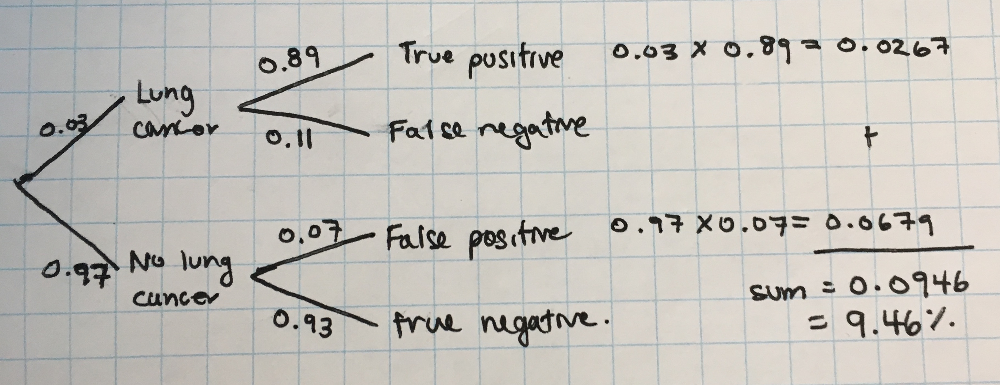

* Due date: Friday, October 4 5:00pm.
* Late penalty: 50% late penalty if submitted within 24 hours of due date, no 
marks for assignments submitted thereafter.
* This assignment is marked out of 29. Marks are indicated for each 
question. 
* Submission process: Please submit your assignment *directly* to 
Gradescope (see the last page for more details). Do not remove any `\newpage` 
tags from this file.

Helpful hints:

- Every function you need to use was taught during lecture! So you may need to 
revisit the lecture code to help you along by opening the relevant files on data 
hub. Alternatively, you may wish to view the code in the condensed PDFs posted 
on bCourses (under Files > Lectures). Good luck!

- Knit your file early and often to minimize knitting errors! If you copy and 
paste code for the slides, you are bound to get an error that is hard to 
diagnose. Typing out the code is the way to smooth knitting! We recommend 
knitting your file each time after you write a few sentences/add a new code 
chunk, so you can detect the source of knitting errors more easily. This will 
save you and the GSIs from frustration!

- If your code runs off the page of the knitted PDF then you will LOSE POINTS! To
avoid this, have a look at your knitted PDF and ensure all the code fits in the 
file. When it doesn't, go back to your .Rmd file and add spaces (new lines) using
the return or enter key so that the code runs onto the next line.

\newpage

**[12 points] Question 1: Simulating birth defect data and sampling from an infinitely large population** 

The Center for Disease Control and Prevention (CDC) estimates that 1 in every
33 infants is born with a birth defect in the United States each year.

a) [3 points] Define a random variable for "birth defect". Write down the probability model for the random variable. Round each percentage to two decimal places (e.g., 0.43224 
would be rounded to 43.22%). Is the sample space discrete or continuous?

Replace the text with your list of proportions and your explanation.

You might want to use the table template below to write out your probability 
model. If not, then delete it.

| Tables   |      Are     |  Cool |
|----------|--------------|-------|
| yadi     | type stuff   | X     |
| yadi     | more stuff   | Y     |
| yada     | etc          | Z     |
 
Solution:

[1 points] Let BD represent the event "birth defect".

[1 points] Then the probability model is:

|Birth defect| BD | BD' |
|------------|----|-----|
| Probability|1/33 = 3.03% | 32/33 = 97.0% |

[1 points] The sample space is discrete.

\newpage

b) [2 points] Simulate data that equals 0 if there is no birth defect and equals
1 if there is a birth defect. Simulate this data for 200 births at a local 
hospital. Be sure to use the risk of birth defect from part a). Assign your 
simulated output the name `sim_01`. Hint: See the lab "lab04_probability" to 
remind yourself how to simulate data of this form. Print your simulated births 
to the screen.

Before you run your simulation, we will "set the seed". We all will set the seed
to 100. This means that everyone's simulation will yield the exact same dataset.
```{r set-seed}
set.seed(100) 
# execute this line before you write your simulation code.
# only execute the set.seed() function one time. 
```

```{r simulate-200-births}
#solution
sim_01 <- rbinom(200, 1, prob = 1/33)
sim_01
```

Notice that `sim_01` is not a data frame, rather it is a vector of numbers. The 
following code stores `sim_01` as a data frame and changes its variable name. 
Run this code and view `sim_01` in the Viewer pane.

```{r, message=F, warning=F}
library(dplyr)
sim_01 <- as.data.frame(sim_01) # watch what happens to sim_01 in your environment
names(sim_01) # prints the variable names in the sim_01 data frame
sim_01 <- sim_01 %>% rename(birth_defect = sim_01)
```

\newpage

c) [2 points] Write code to determine the number of birth defects that occurred in your 
simulation, and the corresponding proportion with birth defects. Assign your 
output the name `output_01`. Print `output_01` to the screen. Hint: Use `dplyr` functions
to do this.

```{r}
#replace this line with your code
#solution
output_01 <- sim_01 %>% summarize(number = sum(birth_defect), 
                                  prop = mean(birth_defect))
output_01
```

\newpage

d) [2 marks] Re-run your simulation four more times and assign the output to a unique 
name each time. Print to the screen the number and proportion after each run. 
(Basically, "recycle" the code above four times)

```{r}
#solution (copy and paste)
#second run
sim_02 <- rbinom(200, 1, prob = 1/33)
sim_02 <- as.data.frame(sim_02) %>% rename(birth_defect = sim_02)
output_02 <- sim_02 %>% summarize(number = sum(birth_defect), 
                               prop = mean(birth_defect))
output_02
#third run
sim_03 <- rbinom(200, 1, prob = 1/33)
sim_03 <- as.data.frame(sim_03) %>% rename(birth_defect = sim_03)
output_03 <- sim_03 %>% summarize(number = sum(birth_defect), 
                               prop = mean(birth_defect))
output_03
#fourth run
sim_04 <- rbinom(200, 1, prob = 1/33)
sim_04 <- as.data.frame(sim_04) %>% rename(birth_defect = sim_04)
output_04 <- sim_04 %>% summarize(number = sum(birth_defect), 
                               prop = mean(birth_defect))
output_04
#fifth run
sim_05 <- rbinom(200, 1, prob = 1/33)
sim_05 <- as.data.frame(sim_05) %>% rename(birth_defect = sim_05)
output_05 <- sim_05 %>% summarize(number = sum(birth_defect), 
                               prop = mean(birth_defect))
output_05
# alternative solution (for loop or...)
# students with programming experience may choose to use a for loop or other 
# iteration function to solve this question.
```

\newpage

e) [2 marks] List in increasing order the simulated proportions from each of your five
simulations. Did you get close to the true value? Explain why there is variation
in the proportions across the simulations.

<Replace the text with your list of proportions and your explanation>

Solution:
List: 0.025, 0.025, 0.03, 0.04, 0.05
Note, since we set the seed, everyone should get the same numbers.

The true value is 1/33 = 0.03 percent, which is very close to the median of 
the simulated values. There is variation across the simulations because the data
was generated randomly, so some samples had more birth defects than others, even 
though they were all drawn from the same underlying distribution.

\newpage

f) [1 mark] Suppose that rather than simulating 5 samples of size 200, we simulated 5 samples
of size 1000. In 1-2 sentences, how would you expect the group of proportion 
estimates from part e) to be different? Comment both on the accuracy of these 
values at predicting the true value, and their variance. If you're not sure, you
can re-run your simulation with a larger sample size and see how the results 
change to deduct the difference.

<Replace the text with your list of proportions and your explanation>

Solution:
The proportion estimates would be less variable (because sample size is larger)
and closer to the true underlying value.

\newpage

**[8 points] Question 2: Probability of HIV and Hepatitis C**

Approximately 1.1 million Americans have HIV and 3.5 million Americans have 
Hepatitis C (HCV). The number of individuals with coinfection (e.g., both HIV 
and HCV) is 300,000. Among individuals with HIV, approximately 25% have 
Hepatitis C. The total US population was approximately 321 million at the time 
of these statistics.

references for these stats:

* https://www.cdc.gov/hiv/basics/statistics.html
* https://www.cdc.gov/media/releases/2016/p0504-hepc-mortality.html
* https://www.cdc.gov/hepatitis/populations/hiv.htm

\newpage

a) [2 points] Calculate the probability that a randomly chosen American will have HIV. 
Calculate the probability that a randomly chosen American will have HCV. Convert
to percentages and round to two decimal places.

<Replace this text with your calculations>

Solution:
Let HIV represent HIV and HCV represent HCV.
P(HIV) = 1.1M/321M = 0.003426791 = 0.34%
P(HCV) = 3.5M/321M = 0.01090343 = 1.09%

\newpage

b) [2 points] Without using the number of co-infections provided in the question,
calculate the probability that someone will have both HIV and HCV?

<Replace this text with your calculations>

Solution:
We know that P(HCV | HIV) = 0.25

We also know that P(HCV | HIV) = P(HCV & HIV)/P(HIV) 
This implies that P(HCV & HIV) = P(HCV | HIV) X P(HIV) = 0.25 X (1.1/321) = 0.0008566978 = 0.09%
\newpage

c) [2 points] Are HIV and HCV infections independent? Show work to support your 
answer.

<Replace this text with your calculations>

Solution:
If HIV and HCV were independent, then:

$P(HIV \& HCV) = P(HCV)\times{P(HIV)} = 0.01090343\times{0.00342679} = 0.00003736378 = 0.003736378\%$

However, from part b) we know that P(HIV & HCV) = 0.09%, which is much higher. 
Thus these infections are not independent.

Alternative explanation:

We know that P(HCV) = 1.09% from part (a) and that P(HCV | HIV) = 25% from the question.
If these infections were independent, these two quantities would be the same. Thus,
they are not independent.

\newpage

d) [2 points] In general, does P(A|B) equal P(B|A)? Calculate P(HIV | HCV) and
report whether or not it is equal to P(HCV | HIV).

<Replace this text with your calculations>
Solution:

[0.5 mark]: No, P(A|B) and P(B|A) are not generally equal.

Using information from part (b) and part (a):

[1 mark] P(HIV | HCV) = P(HIV & HCV)/P(HCV) = 0.0008566978/0.01090343 = 7.86%

[0.5 marks] The P(HIV | HCV) is 7.86% which is different from P(HCV | HIV) which is 25%.

\newpage

**[9 points] Question 3: Screening for lung cancer**

Background reading: Read pages 258-261 (and optionally 261-264) of Baldi & 
Moore, Edition 4. (For earlier editions, look for the section on diagnostic 
testing in medicine or on screening which covers sensitivity, specificity, 
negative predictive value, and positive predictive value). 

Lung cancer is a leading cause of cancer-related deaths in the United States.
Researchers examined the idea of testing all Medicare-enrolled heavy smokers for
lung cancer with a computed tomography (CT) scan every year. In this population, 
the lifetime chance of developing lung cancer is high. In any given year, 
approximately 3% of heavy smokers develop lung cancer. The CT scan positively
identifies lung cancer 89% of the time, and it gives a negative results for 93% 
of individuals who do not have lung cancer.

\newpage

a) [3 points] Use probability notation to express the three proabilities cited. Make sure to  
define each event using a capital letter. Provide the terminology for the 89% and 
93% values based on your readings.

<Replace this text with your answer>

Solution: Let L represent the event lung cancer and CT represent a positive CT
scan.

P(CT | L) = 0.89. This is the sensitivity of the test.
P(CT' | L') = 0.93. This is the specificity of the test.
P(L) = 0.03

\newpage

b) [3 points] What percent of CT scans in this target population would be positive? Answer
this question by making either a probability tree or using absolute frequencies. 
Show your work.

<Replace this text with your answer>

<Note: If you are writing your solutions in R markdown you may want to upload an image of a
hand-drawn tree diagram (this is optional). If so use the following code, or 
delete if not using. Be sure to remove the option "eval = F" if using this code 
or it won't run when you knit the file!:>

```{r, echo=F, out.width="80%", eval=F}
library(knitr)
include_graphics("../Images/your-scans-name.jpg")
# Once you replace the above line with your file's name (after uploading the file
# to datahub's Image sub-directory) you can execute the line of code and 
# verify that the tree diagram is printed below the code chunk.
```

Solution 1. Absolute frequencies. Suppose that there were 1000 people in the 
target population. 

- 30 of them truly have lung cancer. Of these 30, 26.7 will test 
positive for lung cancer. The remaining 3.3 will test negatively.

- 970 of them will not have lung cancer. Of these, 902.1 will correctly test 
negative, will the remaining 67.9 incorrectly test positive

- The total number of positive tests is the sum of the true positives and the 
false positives. This is: 26.7 + 67.9 = 94.6. Thus 94.6/1000 = 9.46% of the 
population will test positive.

Solution 2. Probability tree.

```{r, echo=F, out.width="80%"}

```

\newpage

c) [3 points] What is the probability that a Medicare-enrolled heavy smoker who gets a 
positive scan actually has lung cancer? Write out the probability statement for
this amount and calculate it based on your part (a) work. What term from your 
reading does this value represent? 

<Replace this text with your answer>

Solution: We are trying to solve for P(L | CT). This is the positive predictive value.

Based on absolute frequencies:
Of the 94.6 people with a positive scan, 26.7 will actually have lung cancer. 
Thus, 26.7/94.6 = 28.2% of the positive scans will actually have lung cancer.

Using the probability tree:
0.0946 of the population will have a positive scan, of which 0.0267 will actually
have lung cancer. Thus 0.0267/0.0946 = 28.2% of the positive scans will actually 
have lung cancer.