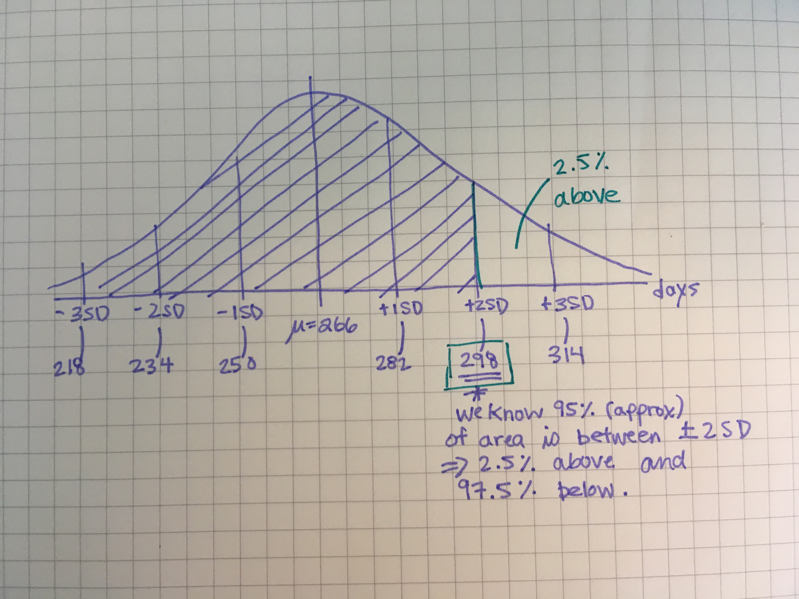
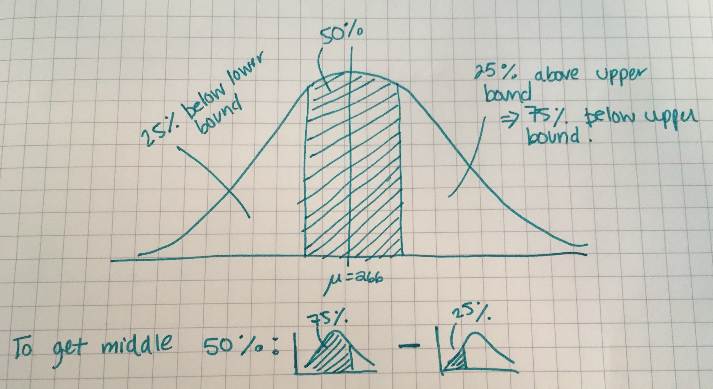

* Due date: Friday, October 11, 5:00pm
* Late penalty: 50% late penalty if submitted within 24 hours of due date, no 
marks for assignments submitted thereafter.
* This assignment is marked out of 29. Marks are indicated for each 
question. 
* Submission process: Please submit your assignment *directly* to 
Gradescope (see the last page for more details). Do not remove any `\newpage` 
tags from this file.

Helpful hints:

- Every function you need to use was taught during lecture! So you may need to 
revisit the lecture code to help you along by opening the relevant files on data 
hub. Alternatively, you may wish to view the code in the condensed PDFs posted 
on bCourses (under Files > Lectures). Good luck!

- Knit your file early and often to minimize knitting errors! If you copy and 
paste code for the slides, you are bound to get an error that is hard to 
diagnose. Typing out the code is the way to smooth knitting! We recommend 
knitting your file each time after you write a few sentences/add a new code 
chunk, so you can detect the source of knitting errors more easily. This will 
save you and the GSIs from frustration!

- If your code runs off the page of the knitted PDF then you will LOSE POINTS! To
avoid this, have a look at your knitted PDF and ensure all the code fits in the 
file. When it doesn't, go back to your .Rmd file and add spaces (new lines) using
the return or enter key so that the code runs onto the next line.


\newpage


**[7 points] Question 1: Pregnancy Length Probabilities** 

An average pregnancy for humans lasts 266 days, with a standard deviation of 
16 days. Assume that human pregnancies are Normally distributed. 

a) [3 marks] Approximately what proportion of births are expected to occur on or before 
298 days? To aid your answer, hand-draw (or use any software) to sketch a Normal
curve, and shade in the area under the Normal density curve the question 
represents. Add dashed lines at the mean +/- 1SD, 2SD and 3SD. Then calculate 
the proportion asked about in the first sentence. You shouldn't need to use R
to perform any calculations for this question. Report the proportion to one decimal place.

(Use the code chunk below to include an image file of your drawing. To do so you 
need to upload the image to Datahub into the Images directory and replace
the file name with your file name. JPG or PNG will both work.)

Solution:

Students should draw the Normal density and at the days corresponding to the 
mean, and the mean +/- 1, 2, and 3 SD. They should notice that mean + 2SD = 298.
They know that 95% of the data is between the mean +/- 2 SD, which implies that 
2.5% of the data is above the mean + 2SD, which implies that approximately 97.5%
of the data is below 298 days.

```{r, out.width="50%"}

```


\newpage


b) [1 mark] Check your answer from part a) using R code. How close is your answer from part a) 
to the exact probability?:

```{r}
#include your code here

#solution
pnorm(q = 298, mean = 266, sd = 16)

### how close to the exact probability?
abs(0.975 - pnorm(q = 298, mean = 266, sd = 16))
```


\newpage


c) [3 marks] What is the range, in days, that the middle 50% of pregnancies last? To aid 
your answer, hand-draw (or use any software) to sketch a Normal curve, and
shade in the area under the Normal density curve that the middle represents. 
Then, use R to calculate the requested range. Round the lower and upper bound of
the range each to two decimal places.

(Use the code chunk below to include an image file of your drawing. To do so you 
need to upload the image to Datahub into the Images directory and replace
the file name with your file name. JPG or PNG will both work.)

Solution

```{r, out.width="50%"}


# want the quantile (aka percentile) such that 25% of the data is below it
qnorm(p = 0.25, mean = 266, sd = 16)

# the upper bound is the quantile (aka percentile) such that 75% of the data is 
# below it
qnorm(p = 0.75, mean = 266, sd = 16)
```

Thus, the range is from 255.21 days to 276.79 days.


\newpage


**[7 points] Question 2: Assessing Normality and Interpreting QQ Plots** 

The number of trees for nine plots of land of 0.1 hectare each have been 
recorded. They are: 18, 4, 22, 15, 18, 19, 22, 12, 12. Are these data Normally 
distributed?


\newpage


a) [3 marks] Make a Normal quantile plot for these data using R. Remember, to make a ggplot
of these data, you need to first input the data as a vector and then convert that
vector to a data frame. Example code has been provided to you to get you started.
After making the plot, assess whether the data appear to approximately follow a 
Normal distribution.

```{r ggplot_qqplot}
library(tidyverse)
# example code
counts <- c(1, 2, 3)
tree_data <- data.frame(counts)

# your code here 

# solution
counts <- c(18, 4, 22, 15, 18, 19, 22, 12, 12)
tree_data <- data.frame(counts)
ggplot(tree_data, aes(sample = counts)) + geom_qq() + geom_qq_line()

```

The QQ Plot of the data quantiles against Normal quantiles is roughly linear, so we 
believe the data approximately follows a Normal distribution.


\newpage


b) [4 marks] Read [this blog post](http://seankross.com/2016/02/29/A-Q-Q-Plot-Dissection-Kit.html) 
by Sean Kross (up to and including the Takeaways), no need
to read the Updates, or to understand the code Sean is using. It is different 
from the code we've been learning in class. Pay most attention to the 
presentation of the Quantile-Quantile plots for all the distributions he presents.
Important note: Sean is plotting "Q-Q" plots and we've been plotting Normal quantile
plots. Q-Q plots are a little different, but the same takeaways apply, meaning 
that if you understand how to interpret Q-Q plots, you can also apply those interpretations
to Normal quantile plots.

Look at the charts entitled "Skewed right" and "Skewed left" and the Quantile-Quantile plots
beside them. Why does the Quantile-Quantile plot for the skewed right plot curve upwards and to the right 
(i.e., above the line), while the Quantile-Quantile plot for the skewed left plot curve 
downwards and to the left?

Solution:

CR note to GSIs: This is actually really tricky to write up. But my hope is that students read this
post and get a better sense of the QQ plots for skewed data and other types. Here 
is what Sean wrote about the plots referenced in this question. I think so long 
as they paraphrase this in some way you can given them marks.

"The second graph is “skewed right,” meaning that most of the data is distributed on the left side with a long “tail” of data extending out to the right. The third graph is “skewed left” with its tail moving out to the left. Looking at the Q-Q plot for the second graph you can see that the last two theoretical quantiles for this dataset should be around 3, when in fact those quantiles are greater than 8. The points depart upward from the straight blue line as you follow the quantiles from left to right. The blue line shows where the points would fall if the dataset were normally distributed. The point’s trend upward shows that the actual quantiles are much greater than the theoretical quantiles, meaning that there is a greater concentration of data beyond the right side of a Gaussian distribution. A similar phenomenon can be seen in the Q-Q plot of the third graph, where there is more data to the left of the Gaussian distribution. The points appear below the blue line because those quantiles occur at much lower values (between -9 and -4) compared to where those quantiles would be in a Gaussian distribution (between -4 and -2)."


\newpage


**[15 points] Question 3: Conducting a general anxiety disorder study** 

Suppose that a new treatment for general anxiety disorder has undergone 
safety and efficacy trials and based on these data 30% of patients with 
general anxiety disorder are expected to benefit from the new treatment. You are
conducting a follow-up study and so far have enrolled 8 participants with 
general anxiety disorder into your study. These patients do not know each other
and represent individuals who responded to a call for study participants that 
they saw on a flyer on campus. 


\newpage


a) [2 marks] Let $X$ represent the number of patients that you have enrolled who benefit
from the treatment. Does $X$ meet the assumptions of a Binomial distribution? 
Thoroughly explain why or why not.

Solution: Yes, because:
 Fixed number of obsevrations (8)
 All the observations appear to be independent (they don't know each other)
 Each is either a success (benefit) or failure (no benefit)
 The probability of success is same for each person


\newpage


b) [1 mark] Using one of the distributions learnt in class that $X$ meets the assumptions
of, calculate by hand the probability that exactly 5 participants will benefit.
Show your work. 

${n \choose k}p^k(1-p)^{n-k}$

${8 \choose 5}0.3^5(1-0.3)^{8-5}$ = 0.04667544


\newpage


c) [1 mark] Confirm your previous calculation using an R function. 

```{r}
# write your code in here.

#solution
dbinom(x = 5, size = 8, prob = 0.3)
```


\newpage


d) [2 marks] Calculate by hand the probability that 6 or more participants will benefit. 
Show your work.

${8 \choose 6}0.3^6(1-0.3)^{8-6} + {8 \choose 7}0.3^7(1-0.3)^{8-7} + {8 \choose 8}0.3^8(1-0.3)^{8-8}$

= 0.01129221


\newpage


e) [1 mark] Confirm your previous calculation using code that depends on `pbinom()`.

```{r}
# write your code here. 

#solution
1 - pbinom(q = 5, size = 8, prob = 0.3)
```


\newpage


f) [1 mark] Re-confirm your previous calculation, this time using code that depends on `dbinom()`

```{r}
# write your code here. 

#solution
dbinom(x = 6, size = 8, prob = 0.3) + dbinom(x = 7, size = 8, prob = 0.3) + dbinom(x = 8, size = 8, prob = 0.3)
```


\newpage


g) [2 marks] Interpret the binomial coefficient, ${8 \choose 7}$, in the context of this 
study. Write out all the possible combinations to achieve ${8 \choose 7}$.

Solution: ${8 \choose 7}$ is the number of ways to have 7 individuals benefitting
out of 8 study participants. There are eight possible ways to see 7 successes 
across 8 individuals:

11111110
11111101
11111011
11110111
11101111
11011111
10111111
01111111


\newpage


h) [4 marks] Calculate the number of patients you would expect to benefit 
from the treatment and the standard deviation. Write a sentence
to interpret the meaning of the mean. If the mean is not a whole number, what 
whole number is most probable?

$\mu = np = 8*0.3 = 2.4$ [1 mark]

$\sigma = \sqrt{np\times (1-p)} = 1.3$ [1 mark]

[1 mark] We expect 2.4 patients to benefit out of the 8. 
[1 mark] An average of 2.4 implies that seeing two patients benefit is the most 
probable number (because 2.4 is closer to 2 than it is to 3). 


\newpage


i) [1 mark] Should you apply a Normal approximation to these data using the $\mu$ and $\sigma$
you calculated in the last question? Why or why not?

Solution: No, because $np = 2.4$ is much smaller than 10, which the rule of thumb 
threshold we used to decide whether we should apply the Normal approximation.

