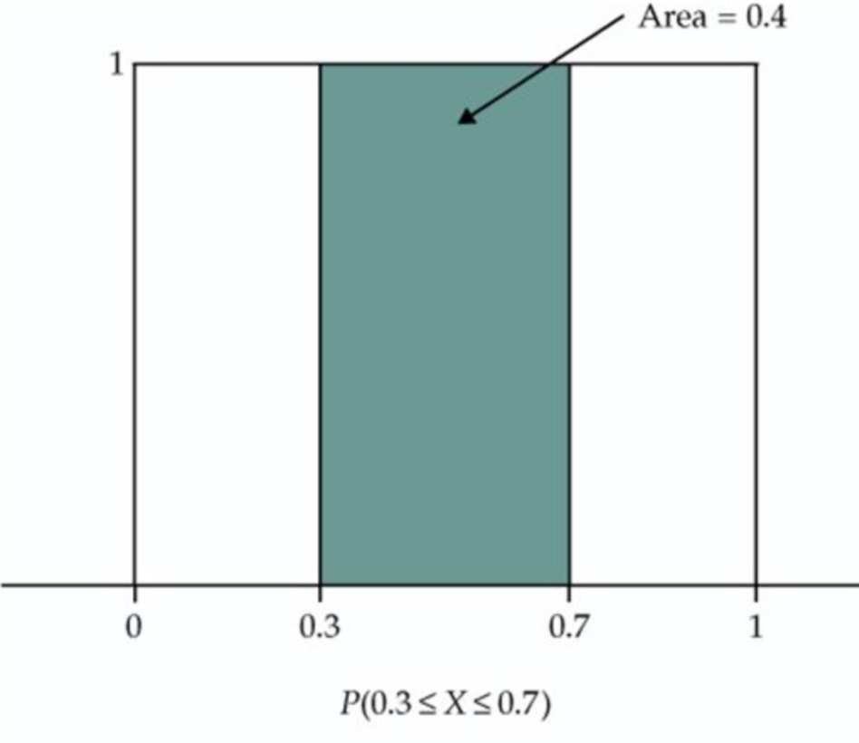

### Instructions

This lab focuses on calculating basic probability and understanding these concepts. 

## Section I: Group Discussion Questions

We will briefly review probability concepts and probability coding in R 
before jumping into applied problems from Baldi and Moore.

#### Discussion Question 1

Probability is a measure of how likely an event is to occur. Match each of the probabilities that follow with each statement of likelihood given. The probability is usually a more exact measure of likelihood than is the verbal statement.

* a) 0
* b) 0.001
* c) 0.3  
* d) 0.6
* e) 0.99
* f) 1 

Map the following statements to a probability value above:

* This event is unlikely.
* This event is impossible, it can never occur.
* This event will almost always occur.
* This event will occur more often than not.
* This event will always occur.
* This event will very rarely occur.

\newpage

#### Discussion Question 2

Consider this image of perceptions of probability. This image is the smoothed 
distribution of how individuals percieve the probability associated with different
statements. Those a wide distribution implies that different people associate the
statement with different levels of probability, and a narrow probability implies
that different individuals tend to associate the statement with probability levels
that are more similar to one another.


Anything unexpected? Which terms have relatively narrow distributions? Which are 
relatively wider?

\newpage

#### Discussion Question 3

In this question we learn about the R code need to simulate events. One reason 
we simulate events is to calculate the probability of something happening over
shorter and longer periods of time. 

The easiest event to simulate is a coin flip. We call a coin "fair" if there is
a 50% chance of landing on heads and an equal chance of landing on tails. We
start with coin flips because it is a *binary* outcome. In public health, many
events of interest are binary, like the occurrence of a specific disease or death.

Here is the code to clip a fair coin one time. 

* Run the code over and over and see what happens.
* Do you get the same output as your neighbor?

```{r one-flip-fair-coin}
# This is like flipping a fair coin one time. Because the coin is fair, 
# there is a 50% chance of flipping heads
rbinom(n = 1, size = 1, prob = 0.5) 
```

Rather than running the above code over and over, we can change the `n` argument
to a number >1 to simulate more than one flip. Give it a try: 

```{r n-100-coin-flipps}
# This is like flipping the fair coin 100 times.
one_hundred_flips <- rbinom(n = 100, size = 1, prob = 0.5) 
one_hundred_flips

sum(one_hundred_flips) #this takes the summation of all the values (i.e., it counts to 1's)
# note: We can't use `summarize()` to calculate the sum() because `one_hundred_flips` is not a
# data frame and dplyr functions can only run computations on data frames.
```

**How many 1's do you expect to get when you flip this coin 100 times?**

Write your answer here.

**How many 1's did you get?**

Write your answer here.

Flip the coin 100 times again and assign it to a new variable.

```{r}
#solution
one_hundred_flips_2 <- rbinom(n = 100, size = 1, prob = 0.5) 
one_hundred_flips_2
```

**How many 1's do you get? Is it the same as your previous 100 flips?**

Write your answer here.

In public health, we are often interested in binary events that are uncommon or
rare, like the risk of a disease or death. We can still use this code to simulate
these events by changing the `prob` argument to the risk that the outcome of
interest occurs. For example, setting `prob = 0.05` is like setting the risk of the
event to 5%.

Rather than coin flips, `n` could represent people in a population, or participants
in a research study.

Try changing the probability and seeing how the results vary.

```{r}
rbinom(n = 100, size = 1, prob = 1)
rbinom(n = 100, size = 1, prob = 0) 
rbinom(n = 100, size = 1, prob = 0.6) 
rbinom(n = 100, size = 1, prob = 0.03)
```

**Think of an event in public health that is relatively common (occurs roughly half of the time). Think of an event that is relatively rare (occurs < 5% of the time)**

Event that is relatively common: Write your answer here.

Event that is relatively rare: Write your answer here.

We will use the `rbinom` functions and related functions from the **binomial**
family once we cover chapter 12.

\newpage

### Example 9.5 "Blood Types" from page 220 of Edition 4 of Baldi & Moore

A person's blood type determines the kind of blood transfusion or organ transplant they can safely get. There are 8 different blood types based on the presence or absence of certain molecules on the surface of red blood cells. A person's blood type is given as a combination of a blood group (one of: O, A, B, or AB) and a Rhesus factor (either + or -). 

Together, the blood group and Rhesus factor define the sample space S for the variable blood type.

**Write out the sample space for blood type**

Write your answer here.

\newpage

### Blood type possibilities

Once we have a sample space, we need to determine the probability associated with
each event in the sample space. For blood types, the proportion of the population
with each blood type varies by race and ethnicity. Within a given race/ethnic group,
we can use the blood types' frequencies in that group to assign their respective 
probabilities. The American Red Cross reports that among Asian Americans there are:

39% blood type O+  
1% blood type O-  
27% blood type A+  
0.5% blood type A-  
25% blood type B+  
0.4% blood type B-  
7% blood type AB+  
0.1% blood type AB-  

Because 39% of all Asian Americans have blood type O+, the probability that a 
randomly chosen Asian American has blood type O+ is 39%, or 0.39.

**Write out the probability model for blood type for Asian Americans. You can write this out by hand on a piece of paper. In R markdown, you can make a table using the following template.**

|Group               | O+   | O-    | etc |
|--------------------|------|-------|-----|
|Probability         | 39%  | 1%    |     |

Reminders:

* A **probability model** is a mathematical description of a random phenomenon consisting of two parts: 
a sample space S and a way of assigning probabilities to events.

* An **event** is an outcome or a set of outcomes of a random phenomenon. That is, an event is a subset of the sample space.

**b. What is the probability that blood type is equal to A+?**  

Using notation, calculate P(Blood type = A+)

Write your answer here.

**c. What is the probability that blood type is not equal to A+?** 

Using notation, calculate P(Blood type $\neq$ A+)? Note: you can hover with your mouse over the text inside the dollar signs to see the "not equals to" sign. When you knit this file, the code inside the dollar signs will compile to show a not equals to sign.  

Write your answer here.

**d. What is P(Blood type = O+ or blood type = O-)?**    

Write your answer here. 

\newpage

## Rhesus factor

Using the probability model for Asian American blood types, write out a new probability
model for an Asian American's Rhesus Factor. 

**First, what is the sample space for Rhesus factor?**

Write your answer here.

**Write out the probability model for a Rhesus factor**

Write your answer here. 

\newpage

Recall the following rules of probability:

1. Any probability is a number between 0 and 1, inclusively.
2. All possible outcomes together must have probability 1.
3. If two events have no outcomes in common, the probability that one or the other occurs is the sum of their individual probabilities.
4. The probability that an event does not occur is 1 minus the probability that the event does occur.

\newpage

### Continuous Probability Model

In the previous question about blood types and Rhesus factors, we created 
probability models and applied probability rules to calculate the chance of 
events or combinations of events. This was an example of a **discrete**
probability space, because the variables "blood type" and "Rhesus factor" were
categorical events. 

Another type of probability model is a **continuous probability model**. For continuous 
models, we most often use data visualization to plot the model and as a tool for
calculating the probability of specific events.

The simplest continuous probability model is the uniform distribution. A uniform
distribution between the numbers 0 and 1 randomly chooses a number between 0 and 1
with equal probability. To sample a random number for this distribution we use 
the following code:

```{r}
runif(1, min = 0, max = 1)
```

The following plot shows the uniform distribution between 0 and 1. It shows how
to calculate the probability that a randomly chosen number from this distribution
is between 0.7 and 0.3. 

```{r}

```

**Using the uniform distribution, find the following probabilities:**

(a) Probability that a random variable X is less than or equal to 0.4, or P ( X $\leq$ 0.4)

Write your answer here.

(b) Probability that a random variable X is less than 0.4, P ( X < 0.4)

Write your answer here.

(c) Probability that X is greater than or equal to 0.3 and less than or equal to 0.5, or P ( 0.3 $\leq$ X $\leq$ 0.5)

Write your answer here.

(d) Probability that X is less than 0.3 or greater than 0.5, or P( X < 0.3 or X > 0.5)

Write your answer here.

**How does your answer for a) compare to b).**

Fill in the blank: The probability of any **individual** value under a continuous distribution is always ___________________.

\newpage
### Calculating probabilities in R for the uniform distribution

We can calculate the previous probabilites using `punif()` in R. The `p` stands for probability and `unif` for uniform.

Note how the `runif()` function generates a **random** value from the **uniform** distribution. 

`punif()` is a different type of function: it calculates the probability **below** the specified point (from the uniform density curve). 

P(X less than or equal to 0.4), or $P(X \leq 0.4)$:

```{r, eval = FALSE}
# Finds the probability below the point 0.4 from the uniform density curve
punif(0.4, min = 0, max = 1)
```

P(X greater than or equal to 0.4), or $P(X \geq 0.4)$:

```{r, eval = FALSE}
# Finds the probability at or above the point 0.4 from the uniform density curve
punif(0.4, min = 0, max = 1, lower.tail = F)
```

**Question**: What does $P(X \leq 0.4)$ equal?

Write your answer here.

**Question**: What does $P(X \geq 0.4)$ equal? Make a sketch on paper of the area under the density curve.

Write your answer here.

Make a sketch on paper shading the area under the uniform density curve that each
of the following equations represent. Then, use R to calculate the probabilities:

(c) $P( 0.3 \leq X \leq 0.5)$

```{r}
#write your R code here.
```

(d) $P( X < 0.3 | X > 0.5)$

```{r}
#write your R code here.
```

**Submission** 

Please submit your lab *directly* to 
Gradescope. You can do this by knitting your file and downloading the PDF to 
your computer. Then navigate to Gradescope.com to submit your assignment. Here 
is a tutorial if you need help: https://www.gradescope.com/get_started. 
Scroll down on that page to "For students:submitting homework".