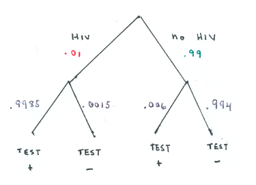

### Instructions

Part 1 of this lab focuses on calculating probability of independent events.

### Section I: Breakout Problems on Independence

## Blood Type

**1. From Baldi and Moore (3E question 10.28, 4E question 10.30)**
All human blood can be one of the following types: O, A, B, or AB,
but the distribution of types varies a bit among groups of people.  
Here are the distributions of blood types for a randomly chosen person in China and in the United States:

Check out the following table:

|       |  $O$ |  $A$ |  $B$ |  $AB$ | 
|-------|------|------|------|-------|
|China  |  0.35|  0.27|  0.26|   0.12| 
|U.S.   |  0.45|  0.40|  0.11|   0.04|   


Choose an American and a Chinese at random, independently of each other.

**1.a	What is the probability that both have type O blood?**

**Solution:** .35  *  .45   =   .1575


**1.b	What is the probability that both have the same blood type?**

**Solution:** 

P(both O) + P(both A) + P(both B) + P(both AB) = 
(.35 * .45) + (.27 * .40) + (.26 * .11) + (.12 * .04) = .2989

**2. From Baldi and Moore (3E question 10.29, 4E not present)**

_Universal blood donors._  
People with type O-negative blood are universal donors.  
That is, any patient can receive a transfusion of type O-negative blood.  
Only 7.2 % of the American population have O-negative blood.  
If 10 people appear at random to give blood, what is the probability that at least  1  of them is a universal donor?

**SOLUTION:**

Key insight: P(at least 1)   =   1  − P(none)
Because the donors are independent, we can use the special case multiplication rule for independence to find P(none)
P(a donor does not have O-negative blood)  =  1 − P(does have O-negative blood)  
 =  1 − .072 	= .928
  
P(none of 10 have O-negative blood)  =	.928 ^ 10	=	.4737

P(at least  1  has O-negative blood) = 1 - .474	= .526

**3. From Baldi and Moore (3E question 10.46, 4E not present)**

_Mendelian inheritance._ 

Some traits of plants and animals depend on inheritance of a single gene.  
This is called _Mendelian inheritance_, after Gregor Mendel (1822-1884).
Each of us has an ABO blood type, which describes whether two characteristics called A and B are present.  
Every human being has two blood type alleles (gene forms), one inherited from our mother and one from our father.  
Each of these alleles can be A, B, or O.  Which two we inherit determines our blood type.  
Here is a table that shows what our blood type is for each combination of two alleles.

|Alleles inherited   | 	Blood type|
|--------------------|------------|
|	A and A            |           A|
|	A and B	           |			    AB|
|	A and O	           |			     A|
|	B and B	           |           B|
|	B and O	           |		    	 B|
|	O and O	           |     			 O|

We inherent each of a parent’s two alleles with probability  .50,
and we inherit independently from our mother and our father.


Punnett squares are used in genetics courses to organize these sorts of information.
The alleles for one parent label the row and for the other parent label the columns.


**3.a Rachel and Jonathan both have alleles A and B. What blood types can their children have?**

**SOLUTION:**

What blood types can their children have?		A, B, or AB


|			  |		|Jonathan |
|-------|---|----|----|
|       |   |  A |  B |
|Rachel	| A	|	AA | AB |
|       | B	|	BA | BB |
          

**3.b Jasmine has alleles A and O. Tyrone has alleles B and O.  What is the probability that a child of these parents has blood type O?**

**SOLUTION:**

This child must inherit the  O  allele from each parent,
	which happens with probability  .50  *  .50   =    .25


**3.c If Jasmine and Tyrone have three children, what is the probability that all three have blood type O?	What is the probability that the first child has blood type O and the next two do not?**

The next calculations assume that they do not have any twins or triplets, 
so that each child is independent.
 
what is the probability that all three have blood type O?	


**SOLUTION:**

.25^3 = .015625


what is the probability that the first child has blood type O and the next two do not?
             
**SOLUTION:**

First is type O AND second is not AND third is not: .25 * .75 * .75 = .140625


## The Flu

**4. From Baldi and Moore (2E question 10.20 to 10.23)**

The November 2009 Gallup-Healthways Well-Being Index survey asked a random sample of 28,606 American adults whether they had the flu on the day before the interview.  Here are the results by age group:
|age group |		flu| 		no flu|	  total|
|----------|-------|----------|--------|
| 18 to 29 |		 88|	   2,486|   2,574|
|	30 to 44 |		132|	   5,162|   5,294|
|	45 to 64 |		276|		11,733|  12,009|
|	65+      |	  122|	   8,607|	  8,729|
|total     |	  618|		27,988|  28,606|

The events  "adult is in a specified age group" and "adult has the flu" are called **independent** if the probability of flu does not vary across the age groups.

The conditional probabilities of flu among those age 65 and older __(0.0140)__ and flu among those 18 to 29 years old __(0.0342)__. 
Compare the probability of flu among those age 65 and older and the probability of flu among those 18 to 29 years old.


**SOLUTION:**

The probability of flu is much lower among the age 65 and older group than among 
the 18 to 29 years old group:  122 / 8,729 = 0.014 vs 88 / 2,486 = 0.0342. 

Perhaps there is a larger proportion of immune individuals in the 65+ community 
due to previous flu exposure.

The probability of flue varies with age group, so the events "age category" and 
"having the flu" are not independent.


This shows that the events "age group" and "adult has the flu" are **not** independent.
Another way to check for independence is to see if the overall probability of flu differs from the age-group stratum specific probabilities of flu. Do this, too.


**SOLUTION:**

The overall probability of the flu is 618 / 27,988 = 0.0216, which is different than 
our age-group specific calculations.


These two strategies always give the same answer.


### Section II: Screening

We will talk about a very important use of conditional probability in public 
health and medicine, which is the idea of tools that screen for health outcomes.
There are many examples of this, including mammograms for detection of breast 
cancer, the prostate specific antigen (PSA) for detection of prostate cancer, as 
well as tests for exposure to infectious diseases, and so forth.  We will 
consider two types of events: i) whether the subject truly has the health condition
of interest (let $D$ denote the disease of interest, and $D'$ its complement), 
and ii) whether a test was positive or not for this outcome (let $+$ denote a 
positive test and $-$ denote its complement, a negative test). There are several 
statistics that are used to evaluate the performance of a test, some of which 
are derivable from each other:

- Sensitivity: $P(+ \mid D)$ or the probability of test being positive if one 
has the disease.
- Specificity: $P(- \mid D')$ or the probability of test being negative given 
one does not have the disease. 
- Positive predictive value (PPV): $P(D \mid +)$ or the probability of having the 
disease if an individual tests positive.
- Negativ predictive value (NPV):  $P(D' \mid -)$ or the probability of not having the 
disease if an individual tests negative.

Consider the following situation: Assume the total number of subjects is 10,000
and that, $P(D) = 0.05$, $P(+ \mid D) = 0.95$, $P(- \mid D') = 0.95$. This set up
implies that the disease is rare, but that a very accurate test exists (i.e., 
equally high sensitivity and specificity).

1. Fill in the following  two-way table with the absolute frequencies using the 
information provided in the problem. (You can fill it in simply by typing the 
frequencies in the nine empty cells.):

|       | $D$ | $D'$ |  Total|
|-------|-----|------|-------|
|+      |     |      |       |
|-      |     |      |       |
| Total |     |      |       |

Solution:

|       | $D$ | $D'$ |  Total|
|-------|-----|------|-------|
|+      | 475 | 475  | 950   |
|-      | 25  | 9025 | 9050  |
| Total | 500 | 9500 | 10000 |

2. Calculate the PPV using the table.

Replace this text with your calculations
  
Solution:
  
PPV = P(D|+) = 475/950 = 0.4947368 = 49.5%
  
  
3. Re-do the two-way table and re-calculate the PPV, this time assuming that 
$P(D)=0.02$. (Note that $P(+ \mid D) = 0.95$, $P(- \mid D') = 0.95$, as with 
the previous question.)  
  
Replace this text with your calculations
    
Solution:
    
|       | $D$ | $D'$ |  Total|
|-------|-----|------|-------|
|+      | 190 |  490 |  680  |
|-      | 10  | 9310 | 9320  |
| Total | 200 | 9800 | 10000 |
  
PPV = P(D|+) = 190/680 = 0.2794118 = 27.9%
  
  
4. Explain why the sensitivity is so high, but the PPV is low for the first 
calculation and even lower for the second calculation.
  
Replace this text with your answer.
  
Solution: When disease is rare, the chance of not having the disease is very common. 
This means, that of all the tests that were positive, a high proportion of them
will be false positive and this proportion outweighs the true positives, leading
to a low PPV.
 
## Testing for HIV.

**5. From Baldi and Moore (question 10.14)**


Enzyme immunoassay tests are used to screen blood specimens for the
presence of antibodies to HIV, the virus that causes AIDS. Antibodies indicate the presence of
the virus. The test is quite accurate but is not always correct. Here are approximate
probabilities of positive and negative test results when the blood tested does and does not
actually contain antibodies to HIV. [Hint: these are conditional probabilities, given HIV status.]

* P( test positive + | antibodies present ) = 0.9985
* P( test positive + | antibodies absent ) = 0.0060
* P( test negative – | antibodies present ) = 0.0015
* P( test negative – | antibodies absent ) = 0.9940

Suppose that 1% of a large population carries antibodies to HIV in its blood.

**5.a Draw a tree diagram representing the HIV status if a person from this population (outcomes: antibodies present or absent) and the blood test result (outcomes: test positive or test negative). **

**SOLUTION:**




**5.b What is the probability that the test is positive for a randomly chosen person from this population?**


**SOLUTION:**

Apply the "Law of Total Probability" to get
P ( test pos ) = P ( test pos AND HIV ) + P ( test pos AND no HIV )


Apply the Multiplication Rule to each of these 2 joint probabilities:

P ( test pos AND HIV ) = P (HIV) * P (test pos | HIV ) 
= .01 * .9985 = .009985


P ( test pos AND no HIV ) = P (no HIV) * P (test pos | no HIV )
= .99 * .006 = .00594

Which gives:
P ( test pos ) = .009985 + .00594 = .015925


**6. From Baldi and Moore (10.16)**

Continue your work and probability assumptions from Question 6.

**6.a What is the probability that a person has the antibody, given that the test is positive.  Explain in your own words what this means.**


**SOLUTION:**
P( HIV antibodies present | test pos ) =

P( HIV antibodies present AND test pos ) / P( test pos) = 
0.009985 / 0.015925 = 0.6270


**6.b. Identify the test's sensitivity, specificity, and positive predictive value.**


**SOLUTION:**
The sensitivity is calculated as:
P (test pos | HIV antibodies present ) = 0.9985

The specificity is calculated as:
P (test neg | HIV antibodies not present ) = 0.994


The positive predictive value is calculated as: 
P(HIV antibodies present | test pos ) = 0.6270

**7. According to the CDC's Behavioral Risk Factor Surveillance System (BRFSS) about 60% of American adults live a sedentary lifestyle.**


**Noting that random sampling gives us independent observations, you randomly select 10 adults from this population.  Find the following probabilities:**


**7.a All 10 have a sedentary lifestyle**

**SOLUTION:**

0.60^10 = 0.006


**7.b At least one does not have a sedentary lifestyle**

**SOLUTION:**

P(not sedentary >= 1) = 1 - P(not sedentary = 0) =
1 - P(all sedentary) = 1 - 0.006 = 0.994


 
### Instructions for Part 2

Part 2 of this lab introduces the normal distribution.

Notation reminder: Baldi and Moore use a compact notation for specifying that a population has a distribution that follows a normal curve with mean $\mu$ and standard deviation $\sigma$ : N( $\mu$ , $\sigma$ )

R Functions Reminder: `qnorm` takes a probability as its input and gives back a value on the distribution (aka a z-score if the distribution is N(0,1)). By default, it assumes the probability area you enter (as a decimal, not a percent) is the area below (or less than) the z score you need.  The `pnorm` function takes a  z value or and X value as its input and gives back a probability area. 

**Question 1. Z scores. **

(From Baldi and Moore, 3E question 11.27, 4E question 11.29) 

Use R to find the standardized value z that satisfies each of the following conditions. In each case, sketch a standard Normal curve with your value of z marked on the axis.

(a)	The probability is 0.8 that a randomly selected observation falls below z.

```{r Section II Q1a}
qnorm(0.8, mean = 0, sd = 1)
```


Solution: qnorm(0.8, mean = 0, sd = 1) = 0.8416212
 
(b)	The probability is 0.35 that a randomly selected observation falls above z.

```{r Section II Q1b}
qnorm(0.35, mean = 0, sd = 1, lower.tail=FALSE)
```

Solution: qnorm(0.35, mean = 0, sd = 1, lower.tail=FALSE) = 0.3853205

**Question 2. Full-Term Birth Weights** 

(From Baldi and Moore, 3E question 11.31, 4E question 11.33) 

For babies born at full term (37 to 39 completed weeks of gestation), the distribution of birth weight (in grams) is approximately normally distributed with a mean of 3350 grams and a standard deviation of 440 grams, N(3350,440).


	(a) What is the 25th percentile of the birthweights for full term babies?
	
```{r Section II Q2a}
qnorm(0.25, mean = 3350, sd = 440)
```

Solution: qnorm(0.25, mean = 3350, sd = 440) = 3053.225
   
	(b) What is the 90th percentile of the birthweights for full term babies?
	
```{r Section II Q2b}
qnorm(0.90, mean = 3350, sd = 440)
```

Solution: qnorm(0.90, mean = 3350, sd = 440) = 3913.883

	(c) What is the range of the middle 50% of birthweights for full term babies?
	
```{r Section II Q2c}
qnorm(0.75, mean = 3350, sd = 440)
```

Solution: qnorm(0.75, mean = 3350, sd = 440) =  3646.775

**Question 3. Late Pre-Term Birth Weights** 
(From Baldi and Moore, 3E question 11.32, 4E question 11.34) 

How much difference do a couple of weeks make for birthweight? Late preterm babies are born with 35 to 37 weeks completed of gestation. The distribution of birth weight (in grams) or late preterm babies is approximately normally distributed with a mean of 2750 grams and a standard deviation of 560 grams,  N(2750,560).


	(a) What is the 25th percentile of the birthweights for late-preterm term babies?
```{r Section II Q3a}
qnorm(0.25, mean = 2750, sd = 560)
```
        
Solution: qnorm(0.25, mean = 2750, sd = 560) = 2372.286

	(b) What is the 90th percentile of the birthweights for late-preterm babies?
z score is  1.282
```{r Section II Q3b}
qnorm(0.9, mean = 2750, sd = 560)
```

Solution: qnorm(0.9, mean = 2750, sd = 560) = 3467.669

	(c) What is the range of the middle 50% of birthweights for late-preterm babies?
```{r Section II Q3c}
qnorm(0.9, mean = 2750, sd = 560)
```

Solution: qnorm(0.9, mean = 2750, sd = 560) = 3127.714
	
**Question 4. Compare your answers to the parts of exercises 2 and 3. What do you notice?**

  Replace this text with your answer.
  
  
Solution: 

Note that the larger standard deviation for the late-preterm babies, 560 g vs 440 g, makes the ranges bigger and the percentiles farther from the mean.
Since the 25th percentile for the late-preterm births is 2372.3 g, well below 2500 g, we know that more than 25% of the late-preterm babies are low birth weight.

**Question 5. Newborn Respirations. **  
(From Baldi and Moore, 3E questions 11.15-11.17, 4E question 11.17-11.19)

  (a) The respiratory rate per minute in newborns varies according to a distribution that is approximately Normal with mean 50 and standard deviation 5. 
The probability that a randomly chosen newborn has a respiratory rate of 55 per minute or more is approximately:

```{r Section II Q5a}
pnorm(55, mean = 50, sd = 5, lower.tail=FALSE)
```

 Solution: pnorm(55, mean = 50, sd = 5, lower.tail=FALSE) = 0.1586553

  (b) The probability that a randomly chosen newborn has a respiratory rate per minute between 40 and 55 is approximately: 
```{r Section II Q5b}
pnorm(55, mean = 50, sd = 5) - pnorm(40, mean = 50, sd = 5)
```
	
Solution: pnorm(55, mean = 50, sd = 5) - pnorm(40, mean = 50, sd = 5) = 0.8185946

**Question 6. Drosophila.**
(From Baldi and Moore, 3E questions 11.20 and 11.22, 4E question 11.23)

The common fruit fly, Drosophila melanogaster, is the most studied organism in genetic research because it is small, easy to grow, and reproduces rapidly. The length of the thorax (where the wings and legs attach) in a population of male fruit flies is approximately Normal with mean 0.800 millimeters (mm) and standard deviation 0.078 mm.

(a)	Choose a male fruit fly at random. The probability that the fly you choose has a thorax longer than 1 mm is about:

```{r Section II Q6a}
pnorm(1, mean = 0.8, sd = 0.078, lower.tail=FALSE)
```

Solution: pnorm(1, mean = 0.8, sd = 0.078, lower.tail=FALSE) = 0.005172149


**Question 7. Z scores.**
(From Baldi and Moore, 3E question 11.25, 4E question 11.27)

Use R’s pnorm function to find the proportion of observations from a standard Normal distribution that fall in each of the following regions. In each case, sketch a standard Normal curve and shade the area representing the region.

(a)	z ≤ −2.25
```{r Section II Q7a}
pnorm(-2.25, 0, 1)
```

Solution:  pnorm(-2.25, 0, 1) = 0.0122

(b)	z ≥ −2.25

```{r Section II Q7b}
pnorm(-2.25, 0, 1, lower.tail = F)
```

Complement: 1 – 0.0122 = 0.9878
Solution: pnorm(-2.25, 0, 1, lower.tail = F) = 0.9877755

(c)	z > 1.77

```{r Section II Q7c}
pnorm(1.77, 0, 1, lower.tail = F)
```

Solution: pnorm(1.77, 0, 1, lower.tail = F) = 0.03836357

(d) −2.25 < z < 1.77

```{r Section II Q7d}
pnorm(1.77, 0, 1) - pnorm(-2.25, 0, 1)
```

Solution: pnorm(1.77, 0, 1) - pnorm(-2.25, 0, 1)  = 0.949412
	Logic from previous: (1 - 0.0384) - 0.0122 = 0.9494


**Submission** 

Please submit your lab *directly* to 
Gradescope. You can do this by knitting your file and downloading the PDF to 
your computer. Then navigate to Gradescope.com to submit your assignment. Here 
is a tutorial if you need help: https://www.gradescope.com/get_started. 
Scroll down on that page to "For students:submitting homework".