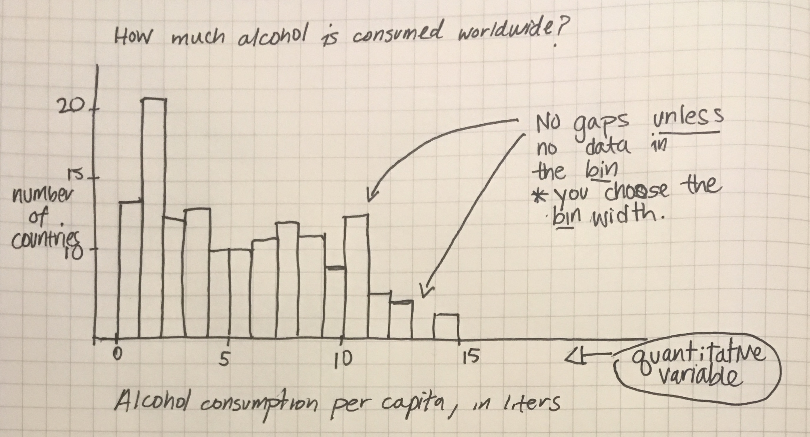

```{r load-libraries, echo = F, message=F}
library(readr)
library(ggplot2)
library(dplyr)
library(forcats)
```

### Learning objectives for today:

1. Link textbook terminology to R terminology
2. What are the four types of variables?
3. Visualization of categorical data: use `ggplot`'s `geom_bar()`
4. Visualization of continuous data: use `ggplot`'s `geom_histogram()`
5. Describe distributions based on their shape, center, and spread.

### Data frames are composed of individuals and the variables on them that we measure

- **Individual** (Row): The units that we are collecting data on.

- **Variables** (Columns): The data being collected.

- Spreadsheet (**Data frame**): The collection of the data.

```{r shrew-dat, echo = F, out.width = "50%", fig.align='center'}

```

### Paw preference in tree shrews

- An example data frame from Baldi & Moore (Ex. 1.1).
- I put these data into a csv file in the Data folder

### Read the data into R, assign it to the name `shrew_data` 
```{r sample-data-frame}
shrew_data <- read_csv("../Data/Ch01_shrew_dat.csv")
```

### View `shrew_data` by typing its name
```{r view-shrew}
shrew_data
```

### Types of variables

- **Categorical** variable: A variable that has grouping levels. Mathematically you can calculate the proportion (%) of individuals in each level of the category.
    - **Nominal** variables: have no underlying order or rank. E.g., hospital ID, HIV status (yes/no variables)  
    - **Ordinal** variables: can be ordered or ranked. E.g., socio-economic status

- **Quantitative** variable: A continuous, numeric variable that you can perform mathematical operations on. Mathematically, we can you take the median or average of these variables
    - **Discrete** variables: can be counted. E.g., number of brain lesions
    - **Continuous** variables: can be measured precisely, with a ruler or scale. E.g, blood alcohol content, gestational age at birth

### Shrew example
Categorize each variable as nominal, ordinal, discrete, or continuous:

- `Subject`:
- `Sex`:
- `Age`:
- `PI`:
- `Bias`:

### Shrew example
Categorize each variable as nominal, ordinal, discrete, or continuous:

- `Subject`: Nominal
- `Sex`: Nominal
- `Age`: Continuous
- `PI`: Continuous
- `Bias`: Nominal

### Participation Question!

### Visualization of categorical data

- What is the best way to visualize one categorical variable at a time?

### Visualization of categorical data

- Generally speaking, **it is not a good idea to use pie charts** 
    - Difficult to judge the area of the smallest slices
    - Areas of the smallest (largest) slices are under-judged (over-judged)
    
- We will not use pie charts in this class (except when looking at the output from Google forms!!)

### Visualization of categorical data

- We prefer **bar graphs** (also called **bar charts**) for the display of categorical data. 
- Bar charts display the number or percent of data for each level of the categorical variable being plotted

```{r, out.width="80%", fig.align='center', echo=FALSE}

```


### An example using infectious disease data

- Task: Make a bar chart of the percent of cases on infectious disease for each 
category of disease.
- First, read and view the infectious disease data from Baldi and Moore:

```{r make-bar-chart}
id_data <- read_csv("../Data/Ch01_ID-data.csv")
id_data
```

### An example using infectious disease data
- Note the variables `number_cases` and `percent_cases`
- What do you want the bar chart to display? What is the `x` and `y` variables for 
a bar chart?
- What `geom_` should we use? (It is one we have not learnt yet)

### `ggplot`'s `geom_bar()` makes a bar chart

```{r, fig.height = 4, fig.width = 9.5}
ggplot(id_data, aes(x = disease, y = percent_cases)) + 
  geom_bar(stat = "identity") + 
  labs(y = "Percent", x = "") +
  theme_minimal(base_size = 15) 
```

* `stat = "identity"` tells geom_bar that we supplied a y variable that is exactly what we want to plot. We do not need geom_bar() to calculate the number or percent for us.
* `base_size` controls the font size on these plots
* `theme_minimal()` affects the "look" of the plot. It removes the grey background and adds grey gridlines

### `fct_reorder` reorders `disease` according to value of `percent_cases`

```{r bar-ordered, fig.height = 4, fig.width = 9.5}
id_data <- id_data %>% 
  mutate(disease_ordered = fct_reorder(disease, percent_cases, .desc = T))

ggplot(id_data, aes(x = disease_ordered, y = percent_cases)) + 
  geom_bar(stat = "identity") + 
  labs(y = "Percent", x = "") +
  theme_minimal(base_size = 15)
```

### Use `aes(fill = type)` to link the bar's fill to the disease type

```{r bar-coloured, fig.height = 5, fig.width = 9.5}
ggplot(id_data, aes(x = disease_ordered, y = percent_cases)) + 
  geom_bar(stat = "identity", aes(fill = type)) +
  labs(y = "Percent", x = "") +
  theme_minimal(base_size = 15) +
  theme(legend.position = "top")
```

* Why do we use `fill` not `col` to shade the bars?

### Visualization of quantitative data

- Histograms look a lot like bar charts, except that the bars touch because the 
underlying scale is numeric. 
- In order to make a histogram, the underlying data needs to be **binned** into 
categories and the number or percent of data in each category becomes the height 
of each bar. 

```{r, out.width="80%", fig.align='center', echo=FALSE}

```

### Example of opioid state prescription rates

- The textbook gives an example using data from 2012.
- The data folder contains updated data from 2018. It came from the paper:
“Opioid Prescribing Rates by Congressional Districts, United States, 2016”, by 
Rolheiser et al. [link](https://ajph.aphapublications.org/doi/10.2105/AJPH.2018.304532)

### Example of opioid state prescription rates

```{r paper-abstract, out.width = "80%", echo=F}

```


### Example of opioid state prescription rates

```{r read-opi-data}
opi_data <- read_csv("../Data/Ch01_opioid-data.csv")
head(opi_data)
```

- `Mean` provides the mean prescribing rate per 100 individuals. Thus, a mean
of 121.31 implies that in Alabama, there were 121.31 opioid prescriptions per 100 
persons, an average across the 7 congressional districts.

### Histogram of opioid prescription rates

- Task: Make a histogram of the average prescribing rates across US states
- What is the x variable? What is the y variable? 
- What `geom` should be used?

### Histogram of opioid prescription rates

```{r hist-binwidth-no-width-specified, fig.height = 4, fig.width = 8}
ggplot(data = opi_data, aes(x = Mean)) + 
  geom_histogram(col = "white") +
  labs(x = "Mean opioid prescription rate (per 100 individuals)", 
       y = "Number of states") +
  theme_minimal(base_size = 15)
```

### `geom_histogram(binwidth = 5)`
```{r hist-binwidth-5, fig.height = 4, fig.width = 8}
ggplot(data = opi_data, aes(x = Mean)) + 
  geom_histogram(col = "white", binwidth = 5) +
  labs(x = "Mean opioid prescription rate (per 100 individuals)", 
       y = "Number of states") +
  theme_minimal(base_size = 15)
```

### `geom_histogram(binwidth = 10)`
```{r hist-binwidth-10, fig.height = 4, fig.width = 8}
ggplot(data = opi_data, aes(x = Mean)) + 
  geom_histogram(col = "white", binwidth = 10) +
  labs(x = "Mean opioid prescription rate (per 100 individuals)", 
       y = "Number of states") +
  theme_minimal(base_size = 15)
```

### Shape, Center, Spread
- When we examine histograms, we can make comments on a distribution's:
    - **Shape**: Is the distribution **symmetric** or **skewed** to the left or right?
    - **Center**: Does the histogram have one peak (unimodal), or two (bimodal) or more?
    - **Spread**: How spread out are the values? What is the range of the data?
    - **Outliers**: Do any of the measurements fall outside of the range of most of the data points?
   
### Is this skewed left or skewed right? 
```{r twitter-not-normal, echo=F, out.width = "75%", fig.align='center'}

```
    
### Visualize quantitative variables over time using time plots

- **Time plots** are a specific subset of line plots where the x variable is time. 
- Unlike the previous plots discussed today, the time plot shows a relationship between two 
variables: 
    i) a quantitative variable 
    ii) time 
- Often, these plots are used to look for cycles (e.g., seasonal 
patterns that recur each year) or trends (e.g., overall increases or decreases 
seen over time).
- The life expectancy trends we plotted last lecture are time plots.

### Recap: What new functions did we use?

1. `geom_bar(stat = "identity")` to make a bar chart when you specify the y variable
2. `geom_histogram()` to make a histogram for which ggplot needs to calculate the count
3. `fct_reorder(var1, var2)` to reorder a categorical variable (`var1`) by a numeric variable (`var2`)
    - from the `forcats` package

