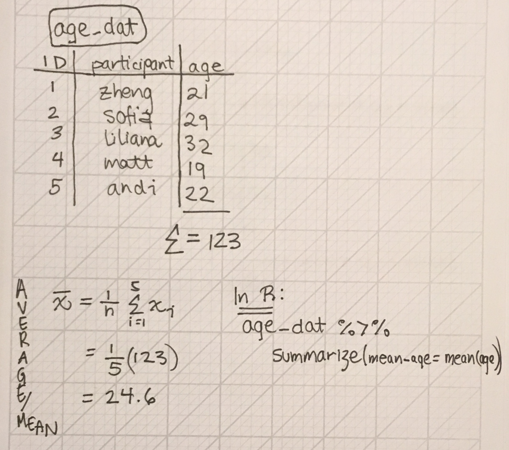
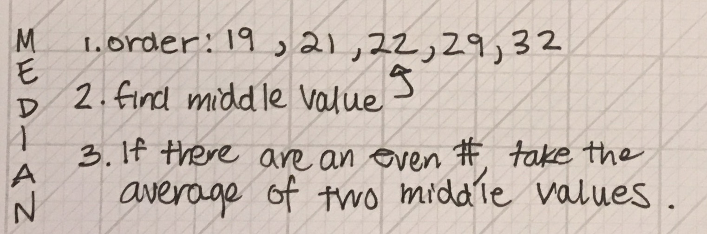
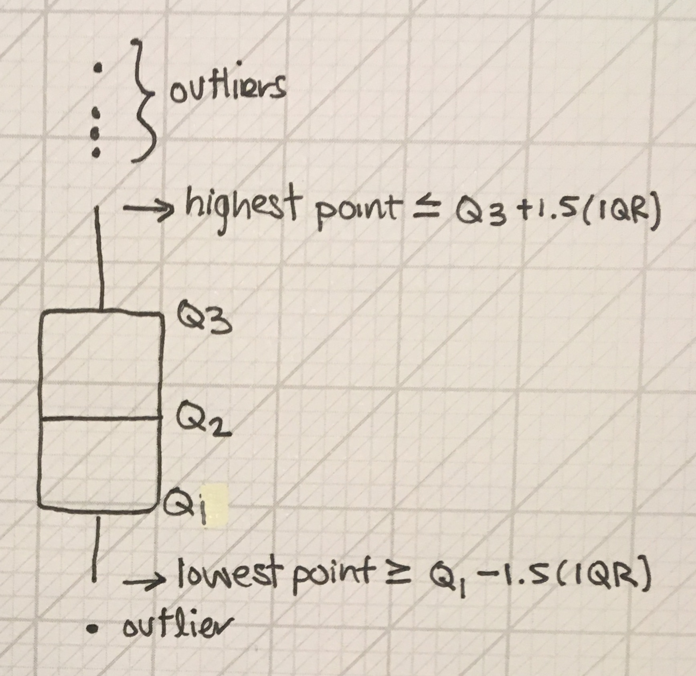
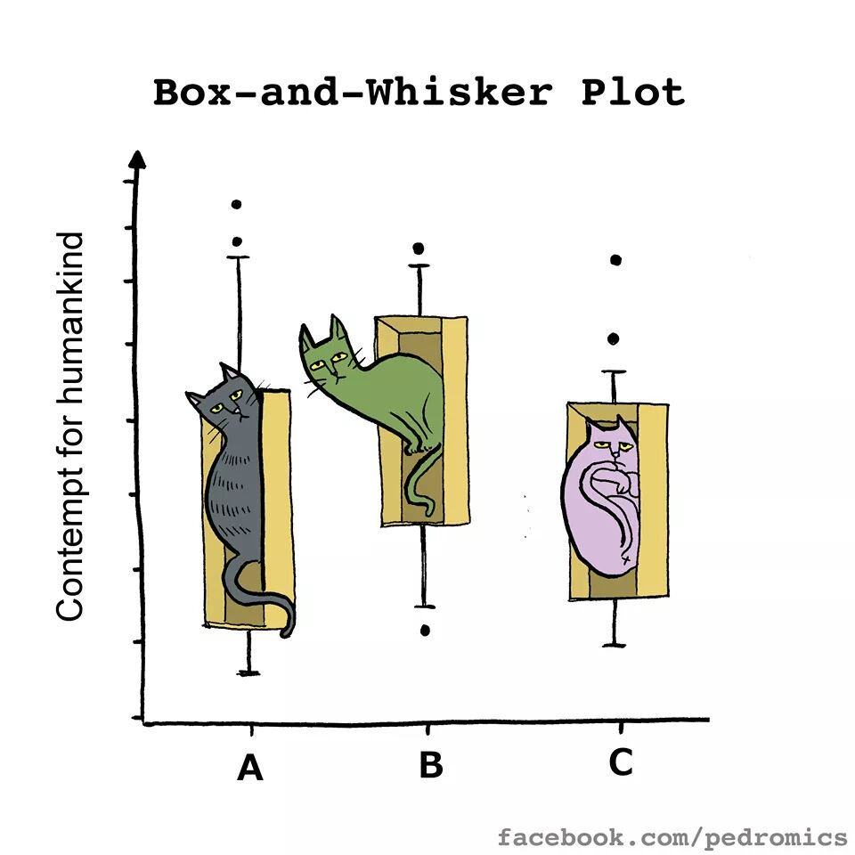

```{r load-libraries, echo = F, message=F}
library(ggplot2)
library(dplyr)
library(fGarch) # students, you don't need to know what this library does. (It used to make the skewed distributions)
```

### Learning objectives for today:

1. Investigate measures of centrality
    - mean and median, and when they're the same vs. different
2. Investigate measures of spread
    - Inter-quartile range (IQR), standard deviation, and variance
3. Create boxplots using `ggplot`

### Measures of central tendency

- The most common are **mean** and **median**

### The arithmetic mean 

$$\bar{x} = \frac{x_1+x_2+...+x_n}{n}$$

$$\bar{x} = \sum_{i=1}^n \frac{x_i}{n}$$

$$\bar{x} = \frac{1}{n}\sum_{i=1}^n x_i$$

### Mean calculation

```{r, fig.align='center', out.width="75%", echo=F}

```

### The median
- Half of the measurements are larger and half are smaller. 
- What is the median if there is an odd number of observations? An even number?

```{r, fig.align='center', out.width="75%", echo=F}

```

### When are these measures approximately equal?
- Answer: When the data has one peak and is roughly **symmetric**
    - In this case, the mean $\approx$ median, so provide either one in a summary 
 
- **Skewed** data
    - mean $\neq$ median
    - Right-skewed data will commonly have a `r #answer: higher`______ mean than median 
    - Left-skewed data will commonly have a `r #answer: lower`______ mean than median
    - Which statistic should we report? `r #it depends, the median gives a more typical value because 50% of measures are above and below, but the average is important when resource planning.` 

### Skewed data

```{r, echo = F, out.width="80%", out.height="80%", fig.align='center'}
# STUDENTS: YOU DON'T NEED TO KNOW THE CODE IN THIS CODE CHUNK USED TO MAKE THIS PLOT.
x <- seq(0,1,length=100)
db <- dbeta(x, 2, 5)
db2 <- dbeta(x, 8, 2)

ggplot() + 
  geom_line(aes(x,db, col = "skewed right"), lwd = 2) + 
  geom_line(aes(x,db2, col = "skewed left"), lwd = 2) +
  labs(y = "Density") + theme_minimal(base_size = 18) + 
  theme(legend.title = element_blank())
```


### Example: Apartment rent in SF

- Let's imagine that we sampled 1000 apartment units across San Francisco and asked for the monthly rental price (before utilities). 

```{r distribution-ex, echo = F, warning=F}
# This code chunk simulates rent price distributions under varying assumptions.
# Note to students: you won't be tested on your understanding of this code chunk.

set.seed(1236)
rent_n <- 1000
rent_mean <- 3400
rent_sd <- 400
rent_skew_factor <- 5
rent_sym <- rnorm(n = rent_n, mean = rent_mean, sd = rent_sd)
rent_sym_out_left <- c(rent_sym[ seq(1, rent_n - 3) ], 1200, 1250, 1500)
rent_sym_out_right <- rent_sym + c(rep(0, rent_n - 3), 6000, 5000, 5500)
rent_left_skew <- rsnorm(
  n = rent_n, mean = rent_mean,
  sd = rent_sd, xi = 1 / rent_skew_factor
)
rent_right_skew <- rsnorm(
  n = rent_n, mean = rent_mean,
  sd = rent_sd, xi = rent_skew_factor
)
rent_bimodal <- c(
  rnorm(n = rent_n / 2, mean = rent_mean, sd = rent_sd),
  rnorm(n = rent_n / 2, mean = 2000, sd = 300)
)

rent_data <- data.frame(
  sym = rent_sym,
  left_skew = rent_left_skew,
  sym_out_left = rent_sym_out_left,
  sym_out_right = rent_sym_out_right,
  right_skew = rent_right_skew,
  bimodal = rent_bimodal
)

rm(rent_sym, rent_left_skew, rent_sym_out_left, 
   rent_sym_out_right, rent_right_skew, rent_bimodal)

rent_summs <- rent_data %>%
  summarize_all(funs(mean, median))

### now sample only 100 apartments
rent_smaller_n <- 100

rent_sym_small <- rnorm(n = rent_smaller_n, mean = rent_mean, sd = rent_sd)
rent_sym_out_left_small <- c(rent_sym_small[ seq(1, rent_smaller_n - 3) ], 1200, 1250, 1500)
rent_sym_out_right_small <- rent_sym_small + c(rep(0, rent_smaller_n - 3), 6000, 5000, 5500)

rent_data_small <- data.frame(
  sym = rent_sym_small,
  sym_out_left = rent_sym_out_left_small,
  sym_out_right = rent_sym_out_right_small
)

rent_summs_small <- rent_data_small %>%
  summarize_all(funs(mean, median))

rm(rent_sym_out_left_small, rent_sym_out_right_small, rent_sym_small)
```

### Example: Apartment rent in SF

- Suppose that the distribution of rent prices looked like this. 
- The green ticks underneath the histograms shows you the exact rent values that 
contribute data to each bin. 

```{r sym-plot, echo = F, fig.width=7, fig.height=4}
sym_plot <- ggplot(rent_data, aes(x = sym)) +
  geom_histogram(binwidth = 200, col = "white", fill = "grey71") +
  labs(x = "Monthly Rent ($)", 
       y = "Count of apartments",
       title = "Symmetric distribution in rental prices ($)") +
  geom_vline(xintercept = rent_summs$sym_mean) +
  geom_vline(xintercept = rent_summs$sym_median, col = "blue") +
  geom_text(aes(x = rent_summs$sym_mean + 150, y = 20),
            label = "Mean", check_overlap = T) +
  geom_text(aes(x = rent_summs$sym_median - 150, y = 20),
            label = "Median", check_overlap = T, col = "blue") +
  geom_rug(col = "#005824", alpha = 0.5) + # hex colours (see link below)
  theme_minimal(base_size = 15)

sym_plot
```

* For those wondering, here is an easier way to pick colors for plotting: [Hex color picker](https://www.google.com/search?q=hex+colors+picker&oq=hex+colour&aqs=chrome.2.69i57j0l5.3494j0j1&sourceid=chrome&ie=UTF-8)

### Example: Apartment rent in SF
- Is this distribution unimodal or bimodal? 
- What do you notice about the estimates of the mean and median in this case?

### Example: Apartment rent in SF

Now suppose that there were three rents within the data set with much larger 
values than the rest of the distribution. Here is the plot for this updated data.

```{r sym-outlier-high-plot, echo = F, fig.width=9, fig.height=4}
sym_out_right_plot <- ggplot(rent_data, aes(x = sym_out_right)) +
  geom_histogram(binwidth = 200, col = "white", fill = "grey71") +
  labs(x = "Monthly Rent ($)", 
       y = "Count", 
       title = "Symmetric, but with outliers on the right, n=1000") +
  geom_vline(xintercept = rent_summs$sym_out_right_mean) +
  geom_vline(xintercept = rent_summs$sym_out_right_median, col = "blue") +
  geom_text(aes(x = rent_summs$sym_out_right_mean + 350, y = 20),
            label = "Mean", check_overlap = T) +
  geom_text(aes(x = rent_summs$sym_out_right_median - 350, y = 20),
            label = "Median", check_overlap = T, col = "blue") +
  geom_rug(col = "#005824", alpha = 0.5) +
  theme_minimal(base_size = 15)

sym_out_right_plot
```

- With 1000 sampled points the outliers do not have a large effect on the mean

### Example: Apartment rent in SF

Imagine instead, there were only 100 sampled points. Here, the outliers have a 
larger effect on the mean. **The mean is not resistant to outliers.**

```{r sym-outlier-high-smaller-n, echo = F, fig.width=9, fig.height=4}
sym_out_right_plot <- ggplot(rent_data_small, aes(x = sym_out_right)) +
  geom_histogram(binwidth = 400, col = "white", fill = "grey71") +
    labs(x = "Monthly Rent ($)", 
       y = "Count", 
       title = "Symmetric, but with outliers on the right, n=100") +
  geom_vline(xintercept = rent_summs_small$sym_out_right_mean) +
  geom_vline(xintercept = rent_summs_small$sym_out_right_median, col = "blue") +
  geom_text(aes(x = rent_summs_small$sym_out_right_mean + 350, y = 20),
            label = "Mean", check_overlap = T) +
  geom_text(aes(x = rent_summs_small$sym_out_right_median - 350, y = 20),
            label = "Median", check_overlap = T, col = "blue") +
  geom_rug(col = "#005824", alpha = 0.5) +
  theme_minimal(base_size = 15)

sym_out_right_plot
```

### Example: Apartment rent in SF
Now, suppose that the sample of estimates did not look like the distribution in the previous example. Instead, it looked like this: 

```{r bimodal-plot, echo = F, fig.width=9, fig.height=4}
bi_plot <- ggplot(rent_data, aes(x = bimodal)) +
  geom_histogram(binwidth = 250, col = "white", fill = "grey71") +
  labs(x = "Monthly Rent ($)", 
       y = "Count", 
       title = "Bimodal") +
  geom_vline(xintercept = rent_summs$bimodal_mean) +
  geom_vline(xintercept = rent_summs$bimodal_median, col = "blue") +
  geom_text(aes(x = rent_summs$bimodal_mean + 150, y = 20),
            label = "Mean", check_overlap = T) +
  geom_text(aes(x = rent_summs$bimodal_median - 150, y = 20),
            label = "Median", check_overlap = T, col = "blue") +
  geom_rug(col = "#005824", alpha = 0.5) +
  theme_minimal(base_size = 15)
bi_plot
```

Describe the distribution. How does it differ from the first plot? Would you want to provide the mean or median for these data? `r #ANSWER: No, you wouldn't because the center is not an appropriate descriptive statistic for a bimodal distribution. It lands between the two peaks and that doesn't accurately describe these data.`

### Example: Apartment rent in SF
Consider instead that the data were skewed right, maybe because there are many expensive apartments in the area. Here is the histogram of data for this example:

```{r right-skew-plot, echo = F, fig.width=9, fig.height=4}
right_skew_plot <- ggplot(rent_data, aes(x = right_skew)) +
  geom_histogram(binwidth = 150, col = "white", fill = "grey71") +
  labs(x = "Monthly Rent ($)", 
       y = "Count", 
       title = "Right-Skewed") +
  geom_vline(xintercept = rent_summs$right_skew_mean) +
  geom_vline(xintercept = rent_summs$right_skew_median, col = "blue") +
  geom_text(aes(x = rent_summs$right_skew_mean + 150, y = 20), label = "Mean", check_overlap = T) +
  geom_text(aes(x = rent_summs$right_skew_median - 150, y = 20), label = "Median", check_overlap = T, col = "blue") +
  geom_rug(col = "#005824", alpha = 0.5) +
  theme_minimal(base_size = 15)
right_skew_plot
```

Why is the mean larger than the median when the data is skewed to the right?

### Summary of measures of central tendency

- The mean and median are similar when the distribution is symmetric. 
- Outliers affects the mean and pull it towards their values. But they do not have a large effect on the median. 
- Skewed distributions also pull the mean out into the tail. 
- Measures of central tendency are not very helpful in multi-modal distributions

`r #Thought experiment. Imagine a symmetric distribution with no outliers. Then replace the max observed value with a value three times as large. How is the mean affected? How is the median affected?`

### Measures of spread (or variation)

To motivate this section, we import data on hospital cesarean delivery rates. 
These data were provided by the first author (Kozhimannil) of a [manuscript](https://www.healthaffairs.org/doi/10.1377/hlthaff.2012.1030) 
published in the journal *Health Affairs*.

* Let's first open the spreadsheet in Excel to see what we are dealing with.
* Notice the hidden columns and unhide them. Look at the variable names.
* Question: How do we import data from Excel that is saved as .xls or .xlsx?

### Measures of spread (or variation)

* Question: How do we import data from Excel that is saved as .xls or .xlsx?
* Answer: Use a function from the `readxl` library.

```{r import-tidy-cs-data}
library(readxl) # this library helps with reading xlsx and xls files into R

CS_dat <- read_xlsx("../Data/Ch02_Kozhimannil_Ex_Cesarean.xlsx", sheet = 1)
head(CS_dat)
names(CS_dat)
```

* Notice that some variable names contain spaces. This is a general coding "no-no".
* Question: Which `dplyr` function can we use to change the variable names?

### Sidenote on variable names containing spaces

* Question: Which `dplyr` function can we use to change the variable names?
* Answer: `rename(new_name = old_name)` can be used. When the old variable name contains spaces, you need to place back ticks around it like this: 

```{r rename-vars-with-spaces}
CS_dat <- CS_dat %>% rename(cs_rate = `Cesarean rate *100`,
                            low_risk_cs_rate = `Low Risk Cearean rate*100`)
```

- See [this paper](https://www.tandfonline.com/doi/abs/10.1080/00031305.2017.1375989) for tips on storing data in Excel for later analysis. 

### Tidy the data for analysis

For our example, we are only interested in each hospital's cesarean delivery rate
and the number of births at the hospital.

```{r tidy-the-data}
CS_dat <- CS_dat %>%
  select(Births, cs_rate) %>%
  rename(num_births = Births)
```

### Histogram of cesarean delivery rates across US hospitals

```{r histogram-cs, fig.width=8, fig.height=4}
ggplot(CS_dat, aes(x = cs_rate)) +
  geom_histogram(col = "white", fill = "grey71", binwidth = 5) +
  labs( x = "Cesarean delivery rate (%)", y = "Count",
    caption = "Data from: Kozhimannil, Law, and Virnig. Health Affairs. 2013;32(3):527-35.") +
  geom_rug(alpha = 0.2, col = "forest green") + #alpha controls transparency
  theme_minimal(base_size = 15)
```

### Spread of cesarean delivery rates across US hospitals
- What can you say about this distribution? Would you expect so much variation 
across hospitals in their rates of cesarean delivery? 
- Let's describe the **spread** of these data using the methods from Chapter 2.

### The inter-quartile range (IQR)

- Q1 is the 1st quartile/the 25th percentile. 
    - 25% of individuals have measurements below Q1.

- Q2 is the 2nd quartile/the 50th percentile/the median. 
    - 50% of individuals have measurements below Q2.

- Q3, the 3rd quartile/the 75th percentile. 
    - 75% of individuals have measurements below Q3. 

- **Q1-Q3** is called the **inter-quartile range** (**IQR**). 
    - What percent of individuals lie in the IQR? `r #answer: the middle 50%`

### Calculating Q1 and Q3 by hand

**Read this on your own time:**

If there are an even number of observations, split the ordered list in half and
find the **median** of each half of the data. The lower median is the Q1 estimate,
and the upper median is the Q2 estimate.

If there are an odd number of observations, then split the data with the lower half
being the ordered values below (but not including) the median, and the upper half
being the irdered values above (but not including) the median. Take the median for
each half of the list to calculate Q1 (lower half) and Q3 (upper half).

You should know how to find Q1, Q2, and Q3 **using a calculator** for small lists of numbers. 

### Quartiles using R

* Note that the function is called `quantile()` not `quartile()`. This is because `quantile()` is a general term, but `quartile()` corresponds specifically to the four groups of data with partitions at the 25th, 50th, and 75th quantiles.

* That is, you can compute a quantile at the 10th percentile but *not* a quartile at the 10th percentile!

```{r quantiles}
CS_dat %>% summarize(
  Q1 = quantile(cs_rate, 0.25),
  median = median(cs_rate),
  Q3 = quantile(cs_rate, 0.75)
  )
```

### R's `quantile` function

- `quantile(variable, 0.25)` will not always give the exact same answer you 
calculate by hand
- The R function is optimized for its statistical properties and is slightly 
different than the textbook's method
- To get the exact same answer as by hand use `quantile(data, 0.25, type = 2)`
- You may use either one in this class. Most commonly, people do not specify
`type=2`

### Another measure of spread: The (full) range
- The difference between the **minimum** and **maximum** value
- `min()` and `max()` are the relevant R functions

### The five number summary

- The five number summary includes the min, Q1, median, Q3, and max of the distribution
- It is a quick way to communicate a distribution's center and spread.
- Based on the summary you can describe the full range of a variable (i.e., the range), where the 
middle 50% of the data lie (i.e., the IQR), and the middle value.

### `dplyr`'s summarize() to calculate the five number summary

```{r five-number-summary}
CS_dat %>% summarize(
  min = min(cs_rate),
  Q1 = quantile(cs_rate, 0.25),
  median = median(cs_rate),
  Q3 = quantile(cs_rate, 0.75),
  max = max(cs_rate)
)
```

### Box (and whisker) plot

* A box plot is a visualization of the quartiles, plus outliers
* These outliers are found as shown in the figure:

```{r, fig.align='center', echo=F, out.width="50%"}

```

### Box plots provide a nice visual summary of the center and spread

Here is the box plot for the cesarean data:

```{r box-plot-ex, width = 2, fig.width = 4.5, fig.height = 5.5}
ggplot(CS_dat, aes(y = cs_rate)) +
  geom_boxplot() +
  labs(y = "Cesarean delivery rate (%)", 
       title = "Box plot of the CS rates across \nUS hospitals",
       caption = "Data from: Kozhimannil et al. 2013.") +
  theme_minimal(base_size = 15) +
  scale_x_continuous(labels = NULL) # removes the labels from the x axis
```

### My favorite box plot

```{r, fig.align='center', out.width="50%", echo=F}

```

### Boxplots

- The center line is the _________.`r #median`
- The top of the box is the _________.`r #Q3`
- The bottom of the box is the _________.`r #Q1`
- The top of the top whisker is equal to _____________.`r #the highest point that is below or equal to Q3 + 1.5*IQR`
- The bottom of the bottom whisker is equal to _____________.`r #the lowest point that is above or equal to Q1 - 1.5*IQR`
- The data points above and below the whiskers are the ________________.`r #outliers`

### Sample variance 

Let $s^2$ represent the variance of a sample. Then,

$s^2 = \frac{(x_1-\bar{x})^2 + (x_2-\bar{x})^2 + ... + (x_n-\bar{x})^2}{n-1}$

* If the denominator was $n$ rather than $n-1$, then the variance would directly be the average of the squared distances between each observation and the sample's mean. 
* Thus, variance is a measure of the average distance and the sample's mean.
* A large variance would indicate a larger spread in the data. A smaller variance would indicate a smaller spread in the data.
* [This video](https://www.khanacademy.org/math/ap-statistics/summarizing-quantitative-data-ap/more-standard-deviation/v/review-and-intuition-why-we-divide-by-n-1-for-the-unbiased-sample-variance) provides intuition of why we divide by $n-1$ rather than $n$.

### Sample variance 

We can rewrite sample variance this way: 

$s^2 = \frac{(x_1-\bar{x})^2 + (x_2-\bar{x})^2 + ... + (x_n-\bar{x})^2}{n-1}$

$s^2 = \frac{1}{n-1}((x_1-\bar{x})^2 + (x_2-\bar{x})^2 + ... + (x_n-\bar{x})^2)$

$s^2 = \frac{1}{n-1}\sum_{i=1}^n(x_i-\bar{x})^2$

### Sample standard deviation 

The sample standard deviation is the square root of the sample variance.

From the last slide, the sample variance is:

$s^2 = \frac{1}{n-1}\sum_{i=1}^n(x_i-\bar{x})^2$

Thus, the sample standard deviation $s$ is: 

$s = \sqrt{\frac{1}{n-1}\sum_{i=1}^n(x_i-\bar{x})^2}$

### Why report standard deviation rather than variance?

* The units of variance is squared (e.g., cm^2^ or grams^2^)
* The units of standard deviation are the same as the observations. That is, if 
you measured distance between maternal residence and the closest hospital, the variance would be reported in miles squared, while the standard deviation is reported in miles.

### `dplyr`'s summarize() to calculate the standard deviation and the variance
```{r five-number-summary-plus, echo = T}
CS_dat %>% summarize(
  cs_sd = sd(cs_rate),
  cs_var = var(cs_rate)
)
```

### Recap: What new functions did we use?
1. `quantile(data, 0.25)`, `quantile(data, 0.75)` for Q1 and Q3, respectively
2. `min()` and `max()` for the full range of the data
3. `sd()` and `var()` for sample standard deviation and variance
4. Used the above within `summarize()` to easily output these measures
4. `ggplot`'s `geom_boxplot`

