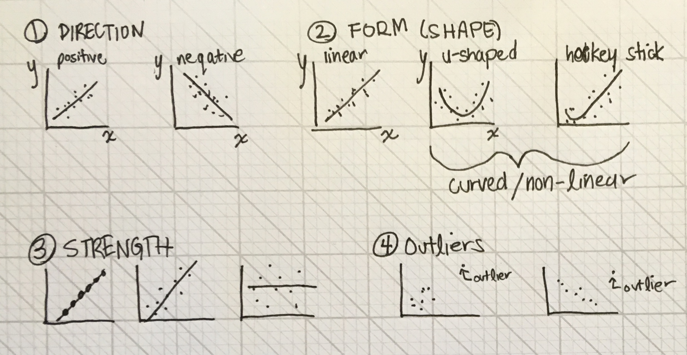
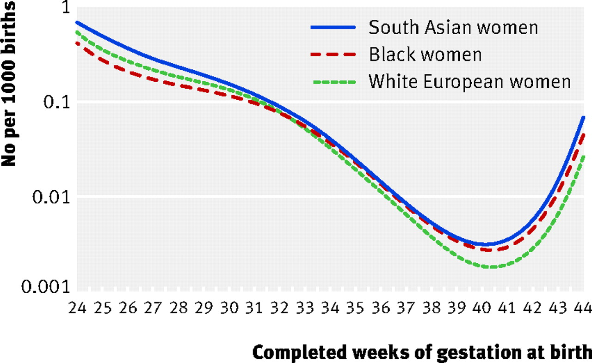
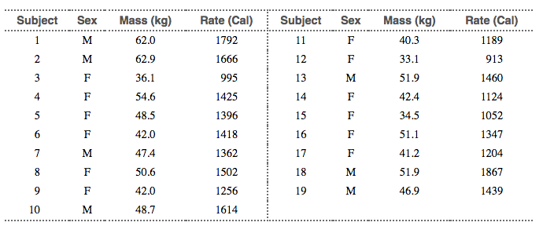

### Recap of chapters 1 and 2

- Histograms ans bar charts to plot the distribution of a variable
- Measures of central tendency (mean, median) and spread (standard deviation, IQR)
- Time plots to examine the *relationship* of a variable with time

### Learning objectives for today

- Explore the relationship between two quantitative variables
    - Direction, form, strength, outliers
    - Association vs. causation

- Make scatter plots to visualize bivariate relationships
    - using `geom_point()` 

- Calculate the **correlation coefficient** to quantify the strength of linear relationships
    - using the `cor()` function
    
### Explanatory (X) and response (Y) variables 

**Bi-directional statements:** 

- "X predicts Y", or "Y predicts X"
- "X is associated with Y", or "Y is associated with X"

- These statements don't comment on causation. Only that two variables are related. 

**Unidirectional statements:**

- "X causes Y"

- This statement is stronger. Not only are X and Y related, X is a cause of Y. That is, if you change X, then Y will also change. Researchers conduct studies to investigate causal claims.

### Which variable is x and which is y?

* In **prediction** modelling, X denotes the variable used to predict the variable of interest (Y)

* In **causal** modeling, X denotes the explanatory (independent) variable and Y denotes the response (dependent) variable

* Graphically, the X variable is on the X (horizontal) axis and the Y variable is the Y (vertical) axis

### Which variable is x and which is y?

1. Each hospital's rate of hospital-acquired infections, and whether the hospital has implemented a hand-washing intervention as part of a cluster randomized trial.

2. A person's leg length and arm length, in centimetres

3. Inches of rain in the growing season and the yield of corn in bushels per day

4. The number of steps a person takes each day and a person's mental health

### How to investigate causation

- Experimentally: Using a randomized controlled trial (RCT) to randomize individuals to different levels 
- Observationally: Conduct an observational study that is specifically designed to investigate causation and reduce the risk of bias
- If we have time, we will talk a bit more about each of these this week. But, to know more, take a class specifically about clinical trial design or take intro. to epidemiology to learn all about conducting observational studies.
- In both settings, biostatistics is used to perform the calculations that are informed but the study design

### Scatter plots

- Scatter plots are a preferred way to visualize a relationship between two variables
- They are used to evaluate:
    - **Direction**: Positive or negative?
    - **Form**: Linear or curved?
    - **Strength**: How close do the points lie to a line?
    - **Outliers**: Any individuals outside the general pattern?

```{r, echo=F, fig.align='center', out.width="75%"}

```


### Bi-directional relationships ex: systolic and diastolic BP

Read in NHANES dataset

```{r import-nhanes}
# students, you do not need to be familar with this chunk of code to read in XPT data.

library(SASxport)
nhanes <- read.xport("../Data/BPX_I.XPT")
head(nhanes)
# View(nhanes) #Viewer provides data labels which are very useful for picking which variables to plot
```

### Bi-directional relationships ex: systolic and diastolic BP

```{r plotnhanes, out.width="80%"}
library(ggplot2)
bp_plot <- ggplot(nhanes, aes(x = BPXSY1, y = BPXDI1)) + 
  geom_point(alpha = 0.1) + 
  theme_minimal(base_size = 15) +
  labs(x = "Systolic BP, mm Hg", 
       y = "Diastolic BP, mm Hg",
       title = "NHANES Data")
```

### Bi-directional relationships ex: systolic and diastolic BP

```{r plotnhanes2, echo=FALSE, out.width="80%"}
bp_plot
```

### Bi-directional relationships ex: systolic and diastolic BP

What do we notice from the plot?

- **Direction**: Positive or negative?

- **Form**: Linear or curved?

- **Strength**: How close do the points lie to a line?

- **Outliers**: Any individuals outside the general pattern?
 
### Association with a plausible direction: motor boats and manatees

Read in the manatee data set (from the text book):
```{r import.mana.data}
library(readr)
mana_data <- read_csv("../Data/Ch03_Manatee-deaths.csv")
```

### Association with a plausible direction: motor boats and manatees

```{r scatter-plot-manta, out.width="80%"}
mana_scatter <- ggplot(data = mana_data, aes(x = powerboats, y = deaths)) + 
  geom_point() + 
  theme_minimal(base_size = 15)

mana_scatter
```

### Association with a plausible direction: motor boats and manatees

What do we notice from the plot?

- **Direction**: Positive or negative?

- **Form**: Linear or curved?

- **Strength**: How close do the points lie to a line?

- **Outliers**: Any individuals outside the general pattern?

### Exercise: Power boats and Manatees

- Add (in thousands) to the x-axis title
- Change the point colour
- Is there a way to incorporate information on year into the graph?

```{r updated-scatter, out.width="80%"}
# FOR US TO WRITE IN CLASS
```

### Example 3: Enzyme activity and temperature

- A study examined the activity rate (in micromoles per second) of a digestive 
enzyme at varying temperatures.

```{r read-enzyme-data}
# this dataset was provided in Baldi and Moore Ed#4 Apply your knowledge 3.4 
enzyme_data <- read_csv("../Data/Ch03_Enzyme-data.csv")
head(enzyme_data)
```

### Scatter plot for enzyme data

```{r scatter-plot-enzyme, out.width="80%"}
ggplot(enzyme_data, aes(x = temperature, y = rate)) +
  geom_point() +
  geom_smooth()
```

Direction: `r #not strictly positive or negative.`

Form: `r #non-linear`

Strength: `r #strong`

Outliers: `r #none`

\newpage

### Example 4: Gestational age and perinatal mortality

```{r, out.width="80%", echo=F}

```

Source: [Balchin et al. BMJ. 2007.](https://www.bmj.com/content/334/7598/833)

### Example 5: Lean body mass and metabolic rate

Problem: Is lean body mass (person's weight after removing the fat) associated 
with metabolic rate (kilocalories burned in 24 hours)?

Plan: A diet study was conducted on 12 women and 7 men that measured lean body 
weight and metabolic rate for each individual.

### Lean body mass and metabolic rate

Data:

```{r ex-sleep-data, echo=F, out.width = "80%"}

```

* What would the corresponding data frame look like in R? 
* How many variables does it have? 
* How many rows?

### Lean body mass and metabolic rate

```{r create-sleep-data-long}
# Note: you won't be tested on writing code using tibble::tribble()
# **Do** know how to look at this code and recognize that it is creating a data set

weight_data <- tibble::tribble(
  ~subject, ~gender, ~mass, ~rate,
  1, "M", 62.0, 1792,
  2, "M", 62.9, 1666,
  3, "F", 36.1, 995, 
  4, "F", 54.6, 1425, 
  5, "F", 48.5, 1396, 
  6, "F", 42.0, 1418, 
  7, "M", 47.4, 1362, 
  8, "F", 50.6, 1502,
  9, "F", 42.0, 1256, 
  10, "M", 48.7, 1614,
  11, "F", 40.3, 1189,
  12, "F", 33.1, 913,
  13, "M", 51.9, 1460,
  14, "F", 42.4, 1124,
  15, "F", 34.5, 1052,
  16, "F", 51.1, 1347,
  17, "F", 41.2, 1204,
  18, "M", 51.9, 1867,
  19, "M", 46.9, 1439
)
```

### Analysis

Exploratory data analysis using scatter plots
```{r scatter-energy-data, out.width="80%"}
weight_scatter <- ggplot(weight_data, aes(x = mass, y = rate)) +
  geom_point() + 
  theme_minimal(base_size = 15)

weight_scatter
```

### Analysis: Colour the points by gender
```{r scatter-energy-data-col, out.width="80%"}
#Fill in during class
```

### Analysis: Create separate plots for men and women
```{r facetted-scatter-energy-data, out.width="80%"}
#Fill in during class
```

### Conclusion

Direction: 

Form:

Strength: 

Outliers: 

\newpage

### Pearson's correlation

Using just our eyes, we can often say something about whether an association 
between two variables is weak or strong. 

```{r corr.plots, out.width="90%", echo=F, comment=NA}
# Students: you do not need to understand any of the code in this chunk 
library(MASS)
library(patchwork)
set.seed(123)

cor_100 <- as.data.frame(mvrnorm(100, mu = c(0,0), 
                     Sigma = matrix(c(1 ,1, 1, 1), ncol = 2), 
                     empirical = TRUE))

cor_70 <- as.data.frame(mvrnorm(100, mu = c(0,0), 
                     Sigma = matrix(c(1,0.7,0.7,1), ncol = 2), 
                     empirical = TRUE))

cor_30 <- as.data.frame(mvrnorm(100, mu = c(0,0), 
                     Sigma = matrix(c(1,0.3,0.3,1), ncol = 2), 
                     empirical = TRUE))

cor_n10 <- as.data.frame(mvrnorm(100, mu = c(0,0), 
                     Sigma = matrix(c(1,-0.1,-0.1,1), ncol = 2), 
                     empirical = TRUE))

cor_n40 <- as.data.frame(mvrnorm(100, mu = c(0,0), 
                     Sigma = matrix(c(1,-0.4,-0.4,1), ncol = 2), 
                     empirical = TRUE))

cor_n100 <- as.data.frame(mvrnorm(100, mu = c(0,0), 
                     Sigma = matrix(c(1,-1,-1,1), ncol = 2), 
                     empirical = TRUE))

cor_100_plot <- ggplot(cor_100, aes(V1, V2)) + geom_point() + 
  labs(title = "Correlation = 1", y = "y", x = "x") + 
  geom_hline(yintercept = mean(cor_100$V2), lty = 2) + 
  geom_vline(xintercept = mean(cor_100$V1), lty = 2) + 
  theme_minimal(base_size = 15) 

cor_70_plot <- ggplot(cor_70, aes(V1, V2)) + geom_point() + 
  labs(title = "Correlation = 0.7", y = "y", x = "x") + 
  geom_hline(yintercept = mean(cor_70$V2), lty = 2) + 
  geom_vline(xintercept = mean(cor_70$V1), lty = 2) + 
  theme_minimal(base_size = 15)

cor_30_plot <- ggplot(cor_30, aes(V1, V2)) + geom_point() + 
  labs(title = "Correlation = 0.3", y = "y", x = "x") + 
  geom_hline(yintercept = mean(cor_30$V2), lty = 2) + 
  geom_vline(xintercept = mean(cor_30$V1), lty = 2) + 
  theme_minimal(base_size = 15)

cor_n10_plot <- ggplot(cor_n10, aes(V1, V2)) + geom_point() + 
  labs(title = "Correlation = -0.1", y = "y", x = "x") +
  geom_hline(yintercept = mean(cor_n10$V2), lty = 2) + 
  geom_vline(xintercept = mean(cor_n10$V1), lty = 2) + 
  theme_minimal(base_size = 15)

cor_n40_plot <- ggplot(cor_n40, aes(V1, V2)) + geom_point() + 
  labs(title = "Correlation = -0.4", y = "y", x = "x") +
  geom_hline(yintercept = mean(cor_n40$V2), lty = 2) + 
  geom_vline(xintercept = mean(cor_n40$V1), lty = 2) + 
  theme_minimal(base_size = 15)

cor_n100_plot <- ggplot(cor_n100, aes(V1, V2)) + geom_point() + 
  labs(title = "Correlation = -1", y = "y", x = "x") +
  geom_hline(yintercept = mean(cor_n100$V2), lty = 2) + 
  geom_vline(xintercept = mean(cor_n100$V1), lty = 2) + 
  theme_minimal(base_size = 15)

cor_100_plot + cor_70_plot + cor_30_plot + 
cor_n10_plot + cor_n40_plot + cor_n100_plot + plot_layout()
```

### Pearson's correlation

- For **linear** associations, we can use **Pearson's correlation coefficient** 
(denoted by $r$) to **quantify the strength** of a linear relationship between two 
variables.

- The correlation between $x$ and $y$ is:

$$r=\frac{1}{n-1}\sum_{i=1}^n(\frac{x_i-\bar{x}}{s_x})(\frac{y_i-\bar{y}}{s_y})$$

### Intuition about Pearson's correlation

To understand this formula, first only consider the numerators of the fractions 
(i.e., $x_i-\bar{x}$ and $y_i-\bar{y}$). If you imagine a scatter plot of x and 
y, we can also add a dashed line at the mean x value of $\bar{x}$ and a dashed 
line line at the mean y value ($\bar{y}$): 

```{r, echo=F, out.width="80%", fig.align='center'}
# Note: you do not need to understand any of the code in this chunk 
# just focus on the description of what I am trying to show you in lecture.

x <- 1:20
y <- 2 * x + 3 + rnorm(20, 0, 9)
corr_data <- data.frame(x, y)

corr.plot <- ggplot(corr_data, aes(x,y)) + 
  geom_text(aes(x = 5, y = 35), label = 1, size = 60, col = "cadetblue1") +
  geom_text(aes(x = 15, y = 35), label = 2, size = 60, col = "cadetblue1") +
  geom_text(aes(x = 5, y = 10), label = 3, size = 60, col = "cadetblue1") +
  geom_text(aes(x = 15, y = 10), label = 4, size = 60, col = "cadetblue1") +
  geom_point() + 
  geom_hline(yintercept = mean(y), lty = 2) +
  geom_vline(xintercept = mean(x), lty = 2) + 
  theme_minimal(base_size = 15) 

corr.plot
```

### Intuition about Pearson's correlation

$r=\frac{1}{n-1}\sum_{i=1}^n(\frac{x_i-\bar{x}}{s_x})(\frac{y_i-\bar{y}}{s_y})$

```{r, echo=F, fig.height = 5, out.width="50%"}
corr.plot
```

- Points in Q2 and Q3 contribute positive products to $r$ 
- Points in Q1 and Q4 contribute negative products to $r$
- The more there are points in Q2 and Q3 vs. Q1 and Q4, the more the value
of the correlation coefficient will be higher and positive
- If you want even more of an explanation see the response to this [stack overflow post](https://stats.stackexchange.com/questions/18058/how-would-you-explain-covariance-to-someone-who-understands-only-the-mean/18200#18200) or take an intermediate statistics class!

### Syntax: Pearson's correlation using `cor()`

```{r, eval = F}
# Students, if you copy this code chunk, you need to set eval = T in the code chunk header for the code to compile

correlation_coeff <- dataset %>% 
  summarize(new_var = cor(x_variable, y_variable))
```

### Syntax: Pearson's correlation using `cor()`
Remember the manatee plot and the weight plot:

```{r show-scatters, fig.width = 9, fig.height=4, fig.align="centre", echo=F, message=F}
mana_scatter + weight_scatter + plot_layout() # you don't need to know the plot_layout() function
```

### Syntax: Pearson's correlation using `cor()`

Now, calculate the correlations between X and Y for manatees:
```{r calc-corr}
library(dplyr)
mana_cor <- mana_data %>% 
  summarize(corr_mana = cor(powerboats, deaths))

mana_cor
```

### Syntax: Pearson's correlation using `cor()`
And for the weight data:
```{r calc-corr2}
weight_cor <- weight_data %>% 
  summarize(corr_weight = cor(mass, rate))
weight_cor
```

### Properties of the correlation coefficient

- Always a number between -1 and 1.
    - -1: A perfect, negative linear association
    - 1: A perfect, positive linear association
    - 0: No linear association 
- Measures association *not* causation. Even a very strong association doesn't 
mean that one variable causes the other.
- Is used to measure the association between two *quantitative* variables.
- Only useful for *linear* associations! 

\newpage

### Properties of the correlation coefficient

- The correlation coefficient is not resistant to outliers 
- E.g., I added two outliers (in red) to the weight_data and recalculated correlation. How much did the correlation change? (It is labelled on each plot.)

```{r add-outliers-to-dataset, echo = F, message=F}
#students, you don't need to know the code in this chunk
weight_data_outliers <- tibble::tribble(
  ~subject, ~gender, ~mass, ~rate,
  20, "M", 62.0, 1213,
  21, "M", 55.9, 1150
  )

weight_data_and_out <- dplyr::full_join(weight_data, weight_data_outliers)
```

```{r plot-with-outliers-and-calc-correlation, out.width="80%", echo = F, message=F}
library(glue) #students, don't need to understand the use of glue here or below to make the label.

weight_cor_out <- weight_data_and_out %>% summarize(corr_out = cor(mass, rate))

weight_scatter_out <- ggplot(weight_data_and_out, aes(x = mass, y = rate)) + 
  geom_point(aes(col = subject >= 20)) +
  scale_color_manual(values = c("black", "red"), guide = FALSE) +
  theme_minimal(base_size = 15) +
  geom_text(x = 37, y = 1750, 
            label = glue("r = {round(weight_cor_out$corr_out, 2)}"), 
            check_overlap = T)

weight_scatter <- weight_scatter + 
  geom_text(x = 37, y = 1750, 
            label = glue("r = {round(weight_cor$corr_weight, 2)}"), 
            check_overlap = T)

weight_scatter + weight_scatter_out + plot_layout()
```
\newpage

### Properties of the correlation coefficient

- Correlations for average measures is typically stronger than correlations for 
individual data

```{r build-breakup-dataset, echo=F, out.width="95%", fig.align=T}
# Example data from 3.8 in Baldi and Moore (page 81 of 4th ed)
# students don't need to know this code, just pay attention to what I say about the plot
# and the correlation of mean scores vs. individual scores

distress_score <- c(rnorm(26, mean = 3.3, sd = 0.25), 
                    rnorm(26, mean = 3.1, sd = 0.25),
                    rnorm(26, mean = 2.9, sd = 0.25),
                    rnorm(26, mean = 2.6, sd = 0.25))

ID <- rep(1:26, 4)

time_since_breakup <- c(rep(0, 26), rep(2, 26), rep(6, 26), rep(10, 26))

breakup_data <- data.frame(ID, time_since_breakup, distress_score)

corr_raw <- breakup_data %>% summarize(corr = cor(time_since_breakup, distress_score))

mean_scores <- breakup_data %>% 
  group_by(time_since_breakup) %>%
  summarize(mean_distress_per_week = mean(distress_score))

corr_means <- mean_scores %>% 
  summarize(corr_with_means = cor(time_since_breakup, mean_distress_per_week))

ggplot(breakup_data, aes(x = time_since_breakup, y = distress_score)) + 
  geom_point(pch = 4, aes(col = "individuals")) +
  geom_point(data = mean_scores, aes(y = mean_distress_per_week, col = "mean"), size = 3) +
  theme_minimal(base_size = 15) +
  theme(legend.title = element_blank()) +
  geom_text(x = 8, y = 3.5, label = glue("Corr. of raw data = {round(corr_raw$corr, 2)}"), check_overlap = T) +
  geom_text(x = 8, y = 3.25, label = glue("Corr. of means = {round(corr_means$corr_with_means, 2)}"), check_overlap = T) +
  labs(x = "Time since breakup", y = "Distress score")
```

### Recap: What functions did we use?

- `geom_scatter()`, `aes(col = gender)` to color points by levels of `gender`
- `summarize()` to calculate correlation using `cor(var1, var2)`

### Important concepts

- Determine which variable is explanatory and which is response, or when it doesn't matter
- Describe the relationship between two variables (form, direction, strength, and outliers)
- Formula for, and properties of the correlation coefficient $r$