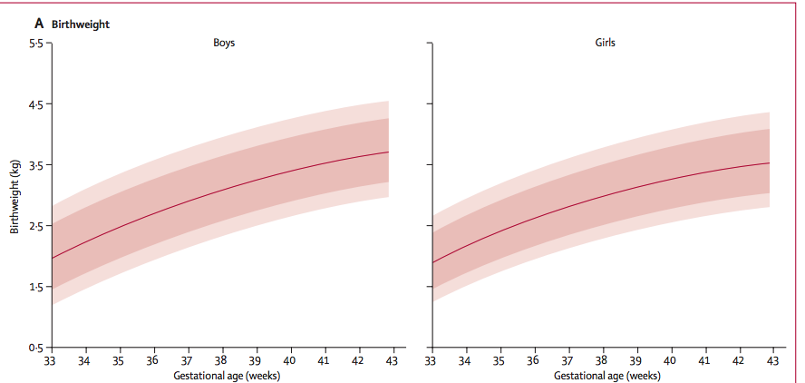
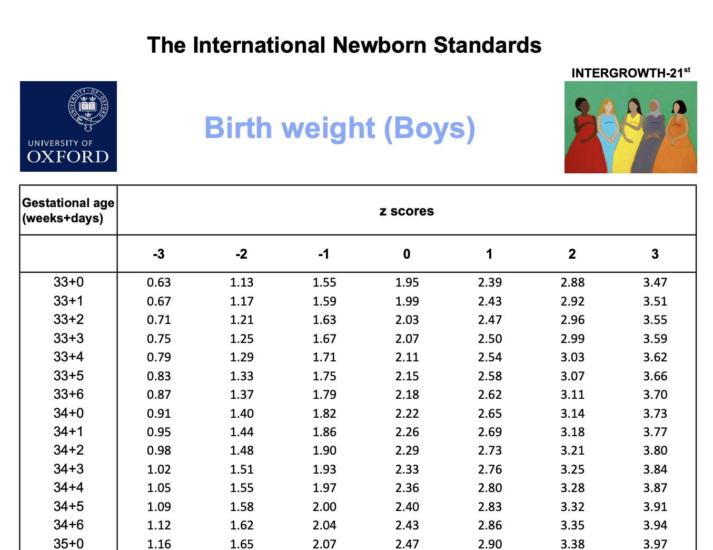

### Learning objectives for today

- Learn about the Normal distribution centered at $\mu$ with a standard deviation of $\sigma$
- Learn about the standard Normal distribution where $\mu=0$ and $\sigma=1$ and compute z-scores
- Calculate cumulative probabilities below or above a given value for any specified Normal distribution using R
- Calculate the quantile for a specified cumulative probability for any specified Normal distributio using R
- Perform simple calculations by hand (using the 68-95-99.7 rule)
- Learn about Q-Q plots and how to use them to assess whether a variable is Normally distributed

### The Normal Distribution

- Here is the Normal distribution with mean of 0 ($\mu$) and standard deviation of 1 ($\sigma$).
- It is:
    - symmetric
    - centered at $\mu$

```{r load-libraries, echo=F, out.width = "80%", warning=F, message=F}
library(ggplot2)
library(patchwork)
library(latex2exp)
library(dplyr)

#students, you don't need to know how to use stat_function()
p1 <- ggplot(data = data.frame(x = c(-3, 3)), aes(x)) +
  stat_function(fun = dnorm, n = 101, args = list(mean = 0, sd = 1), col = "orange") +
  labs(y = "density") + 
  geom_text(aes(x = 0, y = 0.45), label = "mean = 0 \nsd = 1", check_overlap = T, col = "orange") +
  scale_x_continuous(limits = c(-5, 5)) + theme_minimal(base_size = 15)

p1
```

### The Normal Distribution

- Let's add another Normal distribution, this one centered at 2, with the same
standard deviation

```{r, echo=F, out.width="80%"}
p1 <- p1 + stat_function(fun = dnorm, n = 101, args = list(mean = 2, sd = 1), col = "blue") +
  geom_text(aes(x = 2, y = 0.45), label = "mean = 2 \nsd = 1", check_overlap = T, col = "blue") 
p1
```

### The Normal Distribution

- Let's add a third Normal distribution, this one centered at -2, with a standard
deviation of 0.5
- Notice how the distribution is narrowed (i.e., the spread is reduced)
- Why is the distribution "taller"?

```{r, echo=F, out.width="80%"}
p1 <- p1 + stat_function(fun = dnorm, n = 101, args = list(mean = -2, sd = 0.5), col = "forest green")  +
  geom_text(aes(x = -2, y = 0.85), label = "mean = -2 \nsd = 0.5", check_overlap = T, col = "forest green") 
p1
```

### The Normal Distribution

- Can you guess what a Normal distribution with $\mu=1$ and $\sigma=1.5$ would
look like compared to the others?

### The Normal Distribution

```{r, echo=F, out.width="80%"}
p1 <- p1 + stat_function(fun = dnorm, n = 101, args = list(mean = 1, sd = 1.5))  +
  geom_text(aes(x = 1, y = 0.3), label = "mean = 1 \nsd = 2.5", check_overlap = T) 
p1
```

### Properties of the Normal distribution

- the mean $\mu$ can be any value, positive or negative
- the standard deviation $\sigma$ must be a positive number
- the mean is equal to the median (both = $\mu$)
- the standard deviation captures the spread of the distribution
- the area under the Normal distribution is equal to 1 (i.e., it is a density function)
- a Normal distribution is completely determined by its $\mu$ and $\sigma$

### The 68-95-99.7 rule for all Normal distributions

- Approximately 68% of the data fall within one standard deviation of the mean
- Approximately 95% of the data fall within two standard deviations of the mean
- Approximately 99.7% of the data fall within three standard deviations of the mean

Written probabilistically:

- $P(\mu - \sigma < X < \mu + \sigma) \approx 68\%$
- $P(\mu - 2\sigma < X < \mu + 2\sigma) \approx 95\%$
- $P(\mu - 3\sigma < X < \mu + 3\sigma) \approx 99.7\%$

### Calculations using the 68-95-99.7 rule

Example 11.1 from Baldi & Moore on the heights of young women. The distribution 
of heights of young women is approximately Normal, with mean $\mu=64.5$ inches 
and standard deviation $\sigma=2.5$ inches.

- i.e., $H \sim N(64.5, 2.5)$, where H is defined as the height of a young woman

```{r, echo=F, out.width="80%"}
#students, you don't need to know this code

p1 <- ggplot(data = data.frame(x = c(56, 73)), aes(x)) +
  stat_function(fun = dnorm, args = list(mean = 64.5, sd = 2.5)) +
  geom_area(stat = "function", fun = dnorm, args = list(mean = 64.5, sd = 2.5), fill = "#ec7014", xlim = c(57, 72)) +
  geom_area(stat = "function", fun = dnorm, args = list(mean = 64.5, sd = 2.5), fill = "#fe9929", xlim = c(59.5, 69.5), alpha = 0.8) +
  geom_area(stat = "function", fun = dnorm, args = list(mean = 64.5, sd = 2.5), fill = "#fee391", xlim = c(62, 67), alpha = 0.8) +
  labs(y = "density", x = "") + 
  geom_text(aes(x = 64.5, y = 0.18), label = "mean = 64.5 \nsd = 2.5", check_overlap = T) +
  theme_minimal(base_size = 15) +
  geom_segment(aes(x = 64.5+2.5 , y = 0, xend = 64.5+2.5, yend = 0.1), lty = 1) +
  geom_segment(aes(x = 64.5-2.5 , y = 0, xend = 64.5-2.5, yend = 0.1), lty = 1) +
  geom_segment(aes(x = 64.5+2*2.5 , y = 0, xend = 64.5+2*2.5, yend = 0.1), lty = 2) +
  geom_segment(aes(x = 64.5-2*2.5 , y = 0, xend = 64.5-2*2.5, yend = 0.1), lty = 2) +
  geom_segment(aes(x = 64.5+3*2.5 , y = 0, xend = 64.5+3*2.5, yend = 0.1), lty = 3) +
  geom_segment(aes(x = 64.5-3*2.5 , y = 0, xend = 64.5-3*2.5, yend = 0.1), lty = 3) +
  scale_x_continuous(breaks = c(64.5-2*2.5, 64.5-2.5, 64.5, 64.5+2.5, 64.5+2*2.5), 
                     labels = c("59.5\n-2 SD", "62\n-1 SD", "64.5\nmean", "67\n+1 SD", "69.5\n+2 SD"),
                     limits = c(56, 73)) +
  geom_segment(aes(x = 64.5-2.5, xend = 64.5 + 2.5, y = 0.075, yend = 0.075)) +
  geom_label(aes(x = 64.5, y = 0.075), label = "68%", fill = "#fee391") +
  geom_segment(aes(x = 64.5-2*2.5, xend = 64.5 + 2*2.5, y = 0.05, yend = 0.05), lty = 2) +
  geom_label(aes(x = 64.5, y = 0.05), label = "95%", fill = "#fe9929") +
  geom_segment(aes(x = 64.5-3*2.5, xend = 64.5 + 3*2.5, y = 0.025, yend = 0.025), lty = 3) +
  geom_label(aes(x = 64.5, y = 0.025), label = "99.7%", fill = "#ec7014") 
  

p1
```

### Calculations using the 68-95-99.7 rule

- What calculations could you do with these data alone?
- $P(62 < H < 67)=?$
- $P(H > 62)=?$ `r # ans: 50% + 34% = 84%`

### The standard Normal distribution

- The standard Normal distribution is the Normal distribution with $\mu = 0$ and 
$\sigma=1$.
- We write: $N(0,1)$ to denote this distribution
- $X \sim N(0,1)$, implies that the random variable X is Normally distributed.

```{r, echo=F, out.width="80%"}
p1 <- ggplot(data = data.frame(x = c(-3, 3)), aes(x)) +
  stat_function(fun = dnorm, n = 101, args = list(mean = 0, sd = 1), col = "orange") +
  labs(y = "density", x = "") + 
  geom_text(aes(x = 0, y = 0.45), label = "mean = 0 \nsd = 1", check_overlap = T, col = "orange") +
  theme_minimal(base_size = 15) +
  geom_segment(aes(x = 0 , y = 0, xend = 0, yend = 0.4)) +
  geom_segment(aes(x = 1 , y = 0, xend = 1, yend = 0.25), lty = 2) +
  geom_segment(aes(x = -1 , y = 0, xend = -1, yend = 0.25), lty = 2) +
  geom_segment(aes(x = 2 , y = 0, xend = 2, yend = 0.05), lty = 3) +
  geom_segment(aes(x = -2 , y = 0, xend = -2, yend = 0.05), lty = 3) +
  scale_x_continuous(breaks = -3:3, 
                     labels = c(-3, "-2\n-2 SD", "-1\n-1 SD", "0\nmean", "1\n+1 SD", "2\n+2 SD", 3))
p1
```

### Standardizing Normally distributed data

- Any random variable that follows a Normal distribution can be standardized
- If $x$ is an observation from a distribution that has a mean $\mu$ and a 
standard deviation $\sigma$, the standardized value of $x$ is:

$$z = \frac{x-\mu}{\sigma}$$

- A standardized value is often called a **z-score**
- Interpretation: $z$ is the number of standard deviations that $x$ is above or
below the mean of the data.
- We standardize values so that we can have this interpretation, which is agnostic to the underlying mean, standard deviation, and units of measure. Standardizing Normally-distributed data is a quick way to determine if a specific value is much higher or lower than the average value.

### Standardizing Normally distributed data

```{r, out.width="80%", echo=F, fig.align='center'}

```

### Standardizing Normally distributed data

```{r, out.width="80%", echo=F, fig.align='center'}

```

[Reference](https://intergrowth21.tghn.org/site_media/media/articles/newbornsize.pdf)

### Standardizing Normally distributed data

```{r, out.width="80%", echo=F, fig.align='center'}

```

- [Birthweight z-scores for boys](https://intergrowth21.tghn.org/site_media/media/articles/INTERGROWTH-21st_Birth_Weight_Z_Scores_Boys_1.pdf)
- How does this relate to what you see on the previous slide?

### Simulating Normally distributed data in R

Suppose that we measured 1000 heights for young women:

```{r simulate-height-data}
#students, rnorm() is important to know!
heights.women <- rnorm(n = 1000, mean = 64.5, sd = 2.5)
heights.women <- data.frame(heights.women)
```

We can plot the histogram of the heights, and see that they roughly follow from
a Normal distribution. The green curve is a Normal distribution, and the black curve is the density plot based on the actual data:

```{r plot heights, out.width="80%", echo=F, warning=F, message=F}
hist <- ggplot(heights.women, aes(x = heights.women)) +
  geom_histogram(col = "white") + 
  theme_minimal(base_size = 15) 

dens <- ggplot(heights.women, aes(x = heights.women)) + 
  geom_density() + 
  stat_function(fun = dnorm, args = c(mean = 64.5, sd = 2.5), col = "forest green") + 
  theme_minimal(base_size = 15)

hist + dens + plot_layout()
```

### Standardizing Normally distributed data in R

To standardize these data, we can apply the formula to compute the z-score:

```{r compute-z-value}
heights.women <- heights.women %>% mutate(mean = mean(heights.women), 
                                          sd = sd(heights.women), 
                                          z = (heights.women - mean)/sd)

head(heights.women)
```

What would the distribution of the standardized heights look like?

### Standardizing Normally distributed data in R

How are these plots different from the previous ones? Hint: look at the x axis.

```{r plot-z-scores, warning=F, message=F, out.width="80%", echo=F, }
hist_z <- ggplot(heights.women, aes(x = z)) + geom_histogram(col = "white") + 
  theme_minimal(base_size = 15) 

dens_z <- ggplot(heights.women, aes(x = z)) + geom_density() + 
  stat_function(fun = dnorm, args = c(mean = 0, sd = 1), col = "forest green") + 
  theme_minimal(base_size = 15)

hist_z + dens_z + plot_layout()
```

### Finding Normal probabilities

- A cumulative probability for a value x in a distribution is the proportion of 
observations in the distribution that lie at or below x.
- Here is the cumulative probability for x=1.2

```{r, out.width="80%", echo=F}
ggplot(data = data.frame(x = c(-4, 4)), aes(x)) +
  geom_area(stat = "function", fun = dnorm, args = list(mean = 0, sd = 1), fill = "#ec7014", xlim = c(-4, 1.2)) +
  theme_minimal(base_size = 15) +
  stat_function(fun = dnorm, args = list(mean = 0, sd = 1)) +
  geom_segment(x = 1.2, xend = 1.2, y = 0 , yend = 0.195) + 
  scale_x_continuous(breaks = -4:4) + 
  labs(y = "density")
```

### Finding Normal probabilities

- Recall that 100% of the sample space for the random variable X lies under its 
probability density function.
- What is the amount of the area that is below x = 1.2?
- To answer this question we use the `pnorm()` function. (Think: the **p** in `pnorm` stands for probability):

```{r cumulative-prob-below}
pnorm(q = 1.2, mean = 0, sd = 1)
```

This says that approximately 88% of the probability lies below 1.2.

### Finding Normal probabilities

What if we wanted the reverse: P(x>1.2)?

```{r, out.width="80%", echo=F}
ggplot(data = data.frame(x = c(-4, 4)), aes(x)) +
  geom_area(stat = "function", fun = dnorm, args = list(mean = 0, sd = 1), fill = "#ec7014", xlim = c(1.2, 4)) +
  theme_minimal(base_size = 15) +
  stat_function(fun = dnorm, args = list(mean = 0, sd = 1)) +
  geom_segment(x = 1.2, xend = 1.2, y = 0 , yend = 0.195) + 
  scale_x_continuous(breaks = -4:4) + labs(y = "density")
```

```{r probability-above}
1 - pnorm(q = 1.2, mean = 0, sd = 1)
```

Alternatively: 

```{r alternative-prob-above}
 pnorm(q = 1.2, mean = 0, sd = 1, lower.tail = F)
```

So, 11.51% of the data is above x=1.2.

### Finding Normal probabilities

What if we wanted two "tail" probabilities?: $P(x< -1.2 \text{ or } x>1.2)$?

```{r, echo=F, out.width="80%"}
ggplot(data = data.frame(x = c(-4, 4)), aes(x)) +
  geom_area(stat = "function", fun = dnorm, args = list(mean = 0, sd = 1), fill = "#ec7014", xlim = c(1.2, 4)) +
  geom_area(stat = "function", fun = dnorm, args = list(mean = 0, sd = 1), fill = "#ec7014", xlim = c(-4, -1.2)) +
  theme_minimal(base_size = 15) +
  stat_function(fun = dnorm, args = list(mean = 0, sd = 1)) +
  geom_segment(x = 1.2, xend = 1.2, y = 0 , yend = 0.195) + 
  geom_segment(x = -1.2, xend = -1.2, y = 0 , yend = 0.195) + 
  scale_x_continuous(breaks = -4:4) + labs(y = "density")
```

### Finding Normal probabilities

The trick: find one of the tails and then double the area because the distribution
is symmetric:

```{r}
pnorm(q = -1.2, mean = 0, sd = 1)*2
```

### Finding Normal probabilities

What if we wanted a range in the middle?: $P(-0.8 < x < 1.5)$?

```{r, echo=F, out.width="80%"}
ggplot(data = data.frame(x = c(-4, 4)), aes(x)) +
  geom_area(stat = "function", fun = dnorm, args = list(mean = 0, sd = 1), fill = "#ec7014", xlim = c(-0.8, 1.5)) +
  theme_minimal(base_size = 15) +
  stat_function(fun = dnorm, args = list(mean = 0, sd = 1)) +
  geom_segment(x = 1.5, xend = 1.5, y = 0 , yend = 0.13) + 
  geom_segment(x = -0.8, xend = -0.8, y = 0 , yend = 0.29) + 
  scale_x_continuous(breaks = -4:4) + labs(y = "density")
```

### Finding Normal probabilities

```{r}
# step 1: calculate the probability *below* the upper bound (x=1.5)
pnorm(q = 1.5, mean = 0, sd = 1)

# step 2: calculate the probability *below* the lower bound (x = -0.8)
pnorm(q = -0.8, mean = 0, sd = 1)

# step 3: take the difference between these probabilities to get what's left in 
# the middle
pnorm(q = 1.5, mean = 0, sd = 1) - pnorm(q = -0.8, mean = 0, sd = 1)
```

Thus, 72.13% of the data is in the range -0.8 < x < 1.5.

### Your turn

To diagnose osteoporosis, bone mineral density is measured. The WHO criterion for 
osteoporosis is a BMD score below -2.5. Women in their 70s have a much lower BMD
than younger women. Their BMD ~ N(-2, 1). What proportion of these women have a
BMD below the WHO cutoff?

Hint: you do not need to find a z-score!

```{r osteoporosis}
#to fill in during class
```

### Finding Normal percentiles

Recap: so far, we have calculated the *probability* using `pnorm()` given 
specific values for x.

Sometimes we want to go in the opposite direction: We might be given the 
probability within some range and tasked with finding the corresponding x-values.

### Finding Normal percentiles

Example: The hatching weights of commercial chickens can be modeled accurately
using a Normal distribution with mean $\mu=45$ grams and standard deviation 
$\sigma=4$ grams. What is the third quartile of the distribution of hatching 
weights?

That is, what is the x such that 75% of the probability is below it?

```{r, echo=F, out.width="80%"}
ggplot(data = data.frame(x = c(29, 61)), aes(x)) +
  geom_area(stat = "function", fun = dnorm, args = list(mean = 45, sd = 4), fill = "#ec7014", xlim = c(29, 47.7)) +
  theme_minimal(base_size = 15) +
  stat_function(fun = dnorm, args = list(mean = 45, sd = 4)) +
  geom_segment(x = 47.69796, xend = 47.69796, y = 0 , yend = 0.08) + 
  labs(y = "density") +
  geom_text(aes(x = 44, y = 0.05), check_overlap = T, label = "75%", col = "white", size = 8) 
```

### Finding Normal percentiles using the `qnorm()` function

Example: The hatching weights of commercial chickens can be modeled accurately
using a Normal distribution with mean $\mu=45$ grams and standard deviation 
$\sigma=4$ grams. What is the third quartile of the distribution of hatching 
weights?

```{r}
qnorm(p = 0.75, mean = 45, sd = 4)
```

Thus, 75% of the data is below 47.7 for this distribution.

### Using the standard Normal table

- Before we had easy access to computers and software people would use printed 
out tables to compute probabilities
- We can ignore this section of the textbook because we will always have R to 
do the calculations for us

### The Normal quantile plot (a.k.a the Q-Q plot)

- The purpose of making a Q-Q plot is to examine the Normality of a distribution
of a variable.

- If you want to know whether a variable is Normally distributed you could examine 
its histogram to see if it is unimodal and symmetric. However, it is still sometimes
hard to say if it is truly Normal. To do so we use a Q-Q plot.

### Are these data Normally distributed?

- The data is unimodal and symmetric, but is its distribution Normal?

```{r, echo=F, out.width="80%"}
example_data <- data.frame(y = rt(200, df = 5))

ggplot(example_data, aes(y)) + geom_histogram(col = "white") +
  theme_minimal(base_size = 15)
```

### Making a Q-Q plot by hand

These are the steps to make a Q-Q plot by hand. I want you to understand these steps, because they will help you interpret the QQ plot that we will use R to make (thanks, ggplot!)

1. First, arrange the variable in ascending order. Calculate the percentile for each measurement.
For example if you had ten measurements in ascending order, the first measurement is at the 
10th percentile because 10% of the data is at or below its value. The second measurement
is at the 20% because 20% of the data is at or below its value, and so forth.
2. Then, for each of the percentiles you calculated, use that percentile to calculate
the corresponding x-value of the Normal distribution that occurs at that percentile.
For example, x = -1 it the 16th percentile of the N(0, 1) distribution. (We can see this using `pnorm(-1, 0, 1)`.)
3. Make a scatter plot of the calculated x-values (from step 1) on the x-axis and the values from step 2 on the y axis.
4. The closer the data is to a straight line, the more closely it approximates
a Normal distribution.

### Making a Q-Q plot by hand

```{r qqplot-calcs}
#calculate the percentile by hand:
example_data <- example_data %>% 
  arrange(y) %>% 
  mutate(quantile = row_number()/n())

# then calculate the x-value at each percentile from the previous step
# this x-value can be called a z-score because it is from the standard Normal distribution
example_data <- example_data %>% 
  mutate(z_score = qnorm(quantile, mean = 0, sd = 1))

head(example_data)
```

### Look at the Q-Q plot for these data

- Notice that the data overlays the 45 degree line in the middle but not in the 
tails of the distribution. This sort of pattern shows that these data are "wider"
(have larger standard deviation) that a Normally distributed variable.

```{r qqplots, out.width="80%", fig.align=T}
ggplot(example_data, aes(x = z_score, y = y)) + 
  geom_point() + 
  geom_abline(intercept = 0, slope = 1) + 
  theme_minimal(base_size = 15)
```

### Easy way to make a qqplot() where R does all the calculating for you

```{r, out.width="80%", fig.align=T}
ggplot(example_data, aes(sample = y)) + 
  stat_qq() + 
  stat_qq_line() + 
  theme_minimal(base_size = 15)
```

### Another example

Recall the seed data:

```{r}
library(readr)
seed_data <- read_csv("../Data/Ch04_seed-data")

head(seed_data)
```
Is the distribution of `seed_count` Normal?

### Another example

Check out its distribution. It definitely does not look normal:

```{r, out.width="80%", fig.align='center'}
ggplot(seed_data, aes(x = seed_count)) + 
  geom_histogram(col = "white") + 
  theme_minimal(base_size = 15)
```

### Another example

And look at its Q-Q plot. Does the data appear to follow a Normal distribution? 

```{r}
ggplot(seed_data, aes(sample = seed_count)) + 
  stat_qq() + stat_qq_line() + 
  theme_minimal(base_size = 15)
```

### Another example (logged)

You might remember that we took the log of seed_count before we used it in regression.

```{r}
ggplot(seed_data, aes(x = log(seed_count))) + 
  geom_histogram(col = "white", binwidth = 2) + 
  theme_minimal(base_size = 15)
```

### Another example (logged)

How does the Q-Q plot look for the logged variable?

```{r}
ggplot(seed_data, aes(sample = log(seed_count))) + 
  stat_qq() + stat_qq_line() + 
  theme_minimal(base_size = 15) + scale_y_continuous(limits = c(0, 15)) 
```

### Q-Q plot summary

- Review the Q-Q plots from the book on page 290-292 of B&M Edition 4
- Try and gain intuition about when a variable does not appear to fit a Normal distribution
    - Was the distribution skewed?
    - Was there an outlier?
- For each scenario how do these deviations from Normality affect the QQ plot?
    
### Recap of functions used

- `rnorm(n = 100, mean = 2, sd = 0.4)`, to generate Normally distributed data 
from the specified distribution
- `pnorm(q = 1.2, mean = 0, sd = 2)`, to calculate the cumulative probability below
a given value
- `qnorm(p = 0.75, mean = 0, sd = 1)` to calculate the x-value for which some 
percent of the data lies below it
- `stat_qq()` and `stat_qq_line()` to make a Q-Q plot. Notice also that `aes(sample = var1)`
is needed

