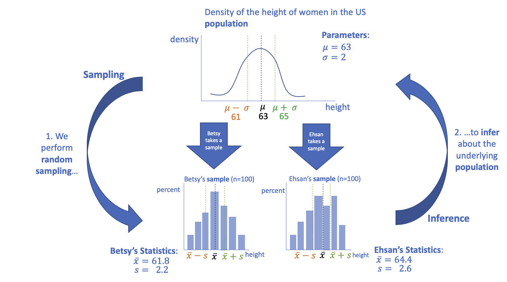
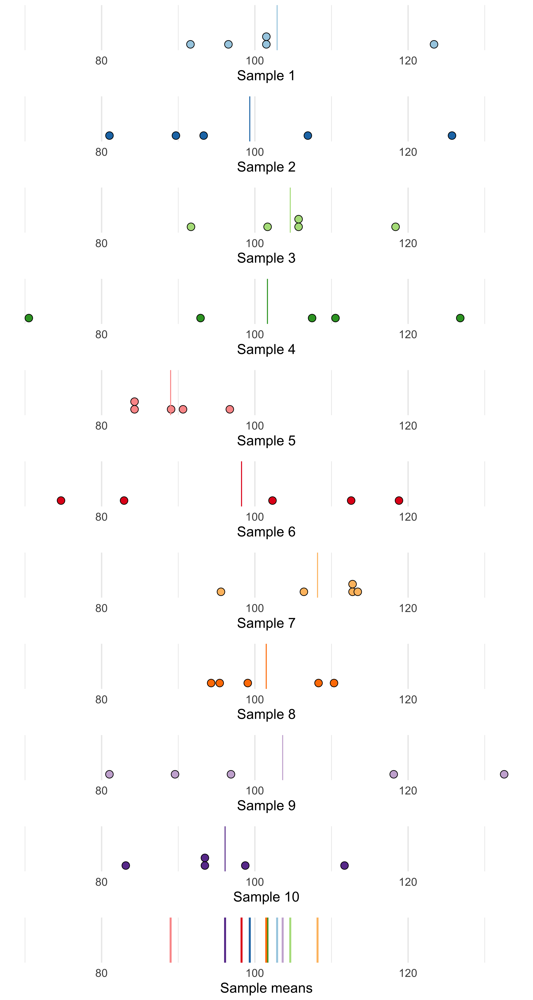
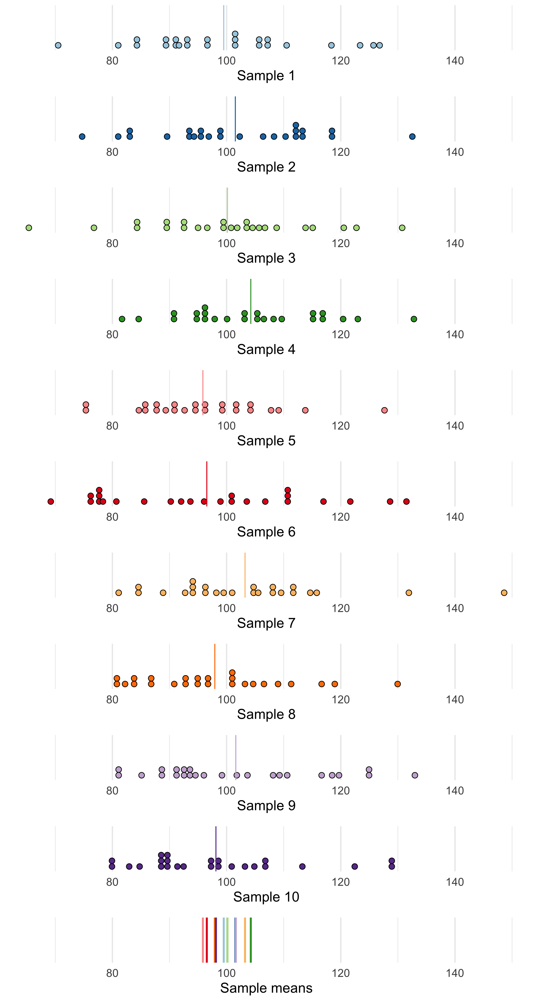

### Announcements

* The assignment deadlines will be shifted to account for the power shutoff.
* I will post an announcement when the next assignment is posted and update
the syllabus with the remaining deadlines.

### Learning objectives for today

* Define what a sampling distribution for the mean is.
* Investigate the properties of the sampling distribution for the mean and proportion
   * What is its mean?
   * What is its standard deviation?
   * What distribution does it follow?
* Learn about the Central Limit Theorem
* Learn about the Law of Large Numbers

### Recall from Chapter 9 the conceptual diagram linking sampling and inference

```{r, echo=F, out.width="80%", fig.align='center'}

```


### Parameter and statistic

**Parameter:** A number that describes the population. Generally the parameter value is 
unknown, because we cannot often examine the entire population. Our goal is to 
estimate its value.

**Statistic:** A number that can be computed from a sample. We using a sample 
statistic to estimate a parameter value.

### Parameter and statistic

$\mu$ and $p$ are population parameters for the mean and proportion. There is one
unique value for each of $\mu$ and $p$ in the underlying population.

$\bar{x}$  and $\hat{p}$ are statistics computed using samples. We refer to them
as the sample mean and sample proportion, respectively. If we change the
sample our statistics will likely also change. Statistics vary across 
samples.

In practice we only take one sample. If our variable of interest is continuous 
(say, annual income), then we use our sample estimate $\bar{x}$ to estimate the
population parameter $\mu$. Very likely, our estimate will deviate from the true
value.

To understand how good our estimate is, we study how much its value varies if
we were to take multiple, repeated samples. If it's value does not vary very much
and if it's value is centered on the true value, then we can say that our estimate
is probably close to the true population parameter value.

### Statistics are random variables

- When we choose a sample *randomly* then the value of the statistic (say the 
mean) will vary from one sample to the next. 
- In practice we only choose one sample and compute one sample mean. However, it
is useful to understand the sampling distribution of the mean so we can better
quantify how much our statistic might differ from the population mean. 
- When we studied the Binomial distribution, we made a histogram of an approximate
sampling distribution for $X$, the number of successes. We will do similar 
exercises here for the sample mean $\bar{x}$ and the sample proportion $\hat{p}$.

### Repeated sampling

* Suppose we have X, a Normally distributed random variable where $X \sim N(100, 15)$.

```{r, out.width="40%", echo=F, message=F, warning=F, fig.align='center'}
library(tidyverse)
p1 <- ggplot(data = data.frame(x = c(50, 150)), aes(x)) +
  stat_function(fun = dnorm, n = 101, args = list(mean = 100, sd = 15), col = "orange") +
  labs(y = "density") + 
  theme_minimal(base_size = 15) + 
  geom_vline(xintercept = 145, lty = 2) + 
  geom_vline(xintercept = 55, lty = 2) +
  ggtitle("Distribution of X in the population.\nN(100, 15), dashed lines at +/- 3SDs") +
  geom_vline(xintercept = 100)

p1

```

* We could take a sample from X, say of 5 people, and based on this sample's 
mean $\bar{x}$ try and estimate $\mu$ (which we know to equal 100 in this example).

* The next slide shows the sampled data (using filled circles) and the sample
mean using a vertical line. Pretend that 10 different students each took their
own samples, independently of one another.

* The bottom panel shows **only** the sampled means.

### Repeated sampling

```{r, echo=F, out.width = "80%", warning=F, message=F}
library(tidyverse)
library(patchwork)


```

### Repeated sampling

What do you notice about the spread of the sample means (see the bottom panel on previous slide) vs. the spread of the sampled data (see all the other panels)?

Let's repeat this process but for $n=25$. That is, let's increase the sample
size.

### Repeated sampling

```{r, echo=F, out.width = "80%"}

```

### Repeated sampling

What is different about the last plot (i.e., the plot of the sample means) for 
$n=25$ vs. $n=5$?

When the sample size is larger, the spread of the sample means is smaller.

We only had 10 sample means. But imagine if we had the sample mean for every
possible sample of size $n$ from the population. This distribution is called
the **sampling distribution**.

### Sampling distribution of the mean $\bar{x}$

The sampling distribution of the mean is the distribution of values taken by the 
statistics **in all possible samples** of the same size from the population.

For a simple random sample of size $n$, the sampling distribution of the mean 
$\bar{x}$ is centered at $\mu$ the population mean and has a standard deviation 
of $\frac{\sigma}{\sqrt{n}}$

This is true for *any* population, provided that the population is much larger
than the sample. A rule of thumb is that the population should be at least 20
times larger than the sample.

### Sampling distribution of the mean $\bar{x}$

- Because the average of the $\bar{x}$ across all possible samples equals $\mu$ 
we say that $\bar{x}$ is an unbiased estimator of the parameter $\mu$. 

- How close any individual estimate falls to the parameter is quantified by the 
spread of the sampling distribution. The standard deviation of $\bar{x}$ is 
called the **standard error**. The standard error of the sample mean is smaller 
than the standard deviation of the distribution of sampled values. That is, 
averages are less variable than individual observations.

### Sampling distribution of a sample mean for a Normal population

- If individual observations have a $N(\mu, \sigma)$ distribution, then the 
sample mean $\bar{x}$ of a simple random sample of size $n$ has a $N(\mu, \frac{\sigma}{\sqrt{n}})$

- What does the standard deviation of the sample mean tell us:
    - As $n$ increases, the standard deviation of the sample means ________.
    - As $\sigma$ increases, the standard deviation of the sample means _______.
    - If n increases by a factor of 100, the standard deviation of the sample 
    _______ by a factor of _____.

### Example of the sampling distribution when the underlying population is Normally distributed

Suppose that IQ scores follow a N(100, 15) distribution. This is the population
distribution of IQ scores.

What is the mean and standard deviation for the sampling distribution if n = 25? 
What distribution does it follow?

1. The mean of the sampling distribution is 100, because it is an unbiased estimator
2. The standard deviation of the sampling distribution is $\frac{\sigma}{\sqrt{n}} = 15/5 = 3$.
Thus, the sample means are much less variable than the individuals observations.
3. Because the underlying data are Normal, the sampling distribution follows a
Normal distribution, here $\bar{x} \sim N(100, 3)$

### The Central Limit Theorem

- From the previous slide, we know that the shape of the sampling distribution 
of a sample mean is Normally distributed when the data are Normally distributed 
to begin with.

- What about for skewed data? Or bimodal data? What is the shape of the sampling 
distribution of the mean? This is the topic of this week's lab.

- As $n$ increases, the shape of the sampling distribution becomes more and more
Normal looking, no matter what the shape of the underlying distribution looked
like, so long as the standard deviation is a finite value.

### The Central Limit Theorem (CLT)

Draw a simple random sample of size $n$ from any population with mean $\mu$ and 
finite standard deviation $\sigma$. When $n$ is large, the sampling distribution
of the sample mean $\bar{x}$ is approximately Normal:

$$\bar{x} \dot\sim N(\mu, \frac{\sigma}{\sqrt{n}})$$

The CLT allows us to use Normal probability calculations to answer questions 
about sample means from many observations (questions relying on the sampling 
distribution of the sample mean) even when the population distribution is not 
Normal.

### CLT example

Suppose you had a variable whose probability distribution function looked like 
this. It is strongly skewed right.:

```{r, out.width = "80%", echo=F, fig.align='center'}
ggplot(data = data.frame(x = c(0, 5)), aes(x)) +
  stat_function(fun = dexp, n = 101, args = list(rate = 1), col = "orange") +
  theme_minimal(base_size = 15) +
  labs(title = "Distribution of a random variable") + 
  geom_vline(aes(xintercept = 1), lty = 2) + geom_text(x = 1.5, y = 0.75, label = "population mean", check_overlap = T)
```

### CLT example

1) Take a sample from the distribution of size 2. This is very small! 
2) For your sample calculate the mean.
3) Repeat steps 1 and 2 1,000 times. 
4) Plot the sampling distribution of the mean. That is, plot the distribution of 
the 1000 means using a histogram.

Compare the population mean (black dashed line) with the mean of the sampled means (red dotted line)

### CLT example

```{r, fig.align='center', out.width="80%", echo=F, warning=F}
pop_data <- rexp(n = 100000, rate = 1)
pop_data <- as.data.frame(pop_data)
names(pop_data)[1] <- "var_1"

calc_sample_mean <- function(df) {
  df %>% 
    summarize(sample_mean = mean(var_1))
}

many.sample.stats.n2 <- replicate(1000, sample_n(pop_data, 2), simplify = F) %>%
  lapply(., calc_sample_mean) %>%
  bind_rows() %>%
  mutate(sample.id = 1:n())

ggplot(many.sample.stats.n2, aes(x = sample_mean)) + 
  geom_histogram(binwidth = 0.25, col = "white") + 
  ggtitle("Histogram of sample means where n=2") +
  geom_vline(aes(xintercept = 1), lty = 2) + 
  geom_vline(aes(xintercept = many.sample.stats.n2 %>% summarise(mean(sample_mean)) %>% pull), lty = 3, col = "red") +
  theme_minimal(base_size = 15) +
  scale_x_continuous(limits = c(0, 6))
```

### CLT example

1) Take a sample from the distribution of size 10. This is very small! 
2) For your sample calculate the mean.
3) Repeat steps 1 and 2 1,000 times. 
4) Plot the sampling distribution of the mean. That is, plot the distribution of 
the 1000 means using a histogram.

Compare the population mean (black dashed line) with the mean of the sampled means (red dotted line)

### CLT example

```{r, fig.align='center', out.width="80%", echo=F, warning=F}
many.sample.stats.n10 <- replicate(1000, sample_n(pop_data, 10), simplify = F) %>%
  lapply(., calc_sample_mean) %>%
  bind_rows() %>%
  mutate(sample.id = 1:n())

ggplot(many.sample.stats.n10, aes(x = sample_mean)) + 
  geom_histogram(binwidth = 0.1, col = "white") + 
  ggtitle("Histogram of sample means where n=10") +
  geom_vline(aes(xintercept = 1), lty = 2) + 
  geom_vline(aes(xintercept = many.sample.stats.n10 %>% summarise(mean(sample_mean)) %>% pull), lty = 3, col = "red") +
  theme_minimal(base_size = 15) +
  scale_x_continuous(limits = c(0, 6))
```

### CLT example

1) Take a sample from the distribution of size 25. This is very small! 
2) For your sample calculate the mean.
3) Repeat steps 1 and 2 1,000 times. 
4) Plot the sampling distribution of the mean. That is, plot the distribution of 
the 1000 means using a histogram.

Compare the population mean (black dashed line) with the mean of the sampled means (red dotted line)

### CLT example

```{r, fig.align='center', out.width="80%", echo=F, warning=F}
many.sample.stats.n25 <- replicate(1000, sample_n(pop_data, 25), simplify = F) %>%
  lapply(., calc_sample_mean) %>%
  bind_rows() %>%
  mutate(sample.id = 1:n())

ggplot(many.sample.stats.n25, aes(x = sample_mean)) + 
  geom_histogram(binwidth = 0.1, col = "white") + 
  ggtitle("Histogram of sample means where n=25") +
  geom_vline(aes(xintercept = 1), lty = 25) + 
  geom_vline(aes(xintercept = many.sample.stats.n25 %>% summarise(mean(sample_mean)) %>% pull), lty = 3, col = "red") +
  theme_minimal(base_size = 15) +
  scale_x_continuous(limits = c(0, 6))
```

### Recap 

- In the CLT example, we looked at the sampling distribution for the sample
mean, $\bar{x}$, when the underlying data was continuous and skewed right.

- The underlying data did not have to be Normally distributed for the 
distribution of the sample means to approach a Normal distribution as the sample
size $n$ became larger.

### Estimating the proportion from a sample

- We can also examine the sampling distribution of the sample proportion $\hat{p}$. 
For a proportion, recall that the underlying data is categorical and commonly
coded using 0/1 coding. A proportion is just a special type of mean where the 
underlying variable is binary (i.e., 0/1, TRUE/FALSE, success/failure are all
coding schemes we might use for binary data).

### Estimating the proportion from a sample

- We have estimated the proportion from a sample a couple time during lecture, 
lab, and assignment. Let's review.

- Suppose an experiment finds 6 of 20 birds exposed to an avian flu strain develop
flu symptoms. Let $X$ represent the number of birds that develop flu symptoms. 
Based on these data, the estimated proportion, $\hat{p}$ of the number of birds
in a larger population that would develop flu symptoms is $\hat{p}=6/20=30\%$.

More generally:

$$\hat{p}=\frac{\text{count of successes in sample}}{\text{size of sample}}=\frac{X}{n}$$

### Recall from Chapter 12...

The avian flu example might remind you of the Binomial distribution: We have a
finite sample size (here n=20) and are counting X, the number of "successes".

Recall from our lecture on the Binomial distribution that when n is 
"large enough", $X \dot\sim N(np, \sqrt{np(1-p)})$. Our
rule of thumb for large enough was $np \geq 10$ and $n(1-p) \geq 10$.

While this tells us the approximate distribution for X, we would like to know the
distribution for $\hat{p}$, the sample proportion. This will help us evaluate 
how good our sample estimate $\hat{p}$ is at estimating the population parameter
$p$. Again, we need to ask, what happens when we take many samples?

### Sampling distribution of the proportion $\hat{p}$

Choose a simple random sample of size $n$ from a large population that contains
population proportion $p$ of successes. Let $\hat{p}$ be the sample proportion 
of successes. Then:

$$\hat{p}=\frac{\text{count of successes in the sample}}{n}$$. Then:

- The mean of the sampling distribution is $p$, the population parameter
- The standard deviation of the sampling distribution is $\sqrt{\frac{p(1-p)}{n}}$
- As the sample size increases, the sampling distribution of $\hat{p}$ becomes
approximately Normal. This is the Central Limit Theorem for a proportion!
- For this to apply, we require:
    - the population is at least 20 times as large as the sample
    - both np and n(1-p) are larger than 10.

### Sampling distribution of the proportion $\hat{p}$

- Remember the true sampling distribution is the histogram we would make if we 
looked at **all possible samples of size $n$** from the population and calculated
their sample proportions. 

- If we consider repeated sampling (say taking 1000 samples) from a distribution,
this gives us an approximation of the sampling distribution for the proportion.

### The Law of Large Numbers (TLLN)

As the sample size increases, $\bar{x}$ is guaranteed to approach $\mu$, and 
$\hat{p}$ is guaranteed to approach $p$, the true population parameter.

The most applicable examples of TLLN in the real world are gambling casinos and
insurance companies. They rely on TLLN which describes the long-run regularity of 
gambling (which can be described using probability) and of insurance claims 
(where most people make only small claims, yet some will make large claims) to 
make sure their businesses can make a profit.

### The Central Limit theorem summarized

- Applies to both the sample mean $\bar{x}$ and the sample proportion $\hat{p}$.
- When the sample size is large, the sampling distribution is approximately Normal,
no matter what the underlying distribution looked like.
- The larger the sample, the better the approximation.
- The mean of the sampling distribution of $\bar{x}$ is $\mu$, and of $\hat{p}$ 
is $p$, no matter the sample size. Thus these estimates are called **unbiased
estimators**
- The standard deviation of the sampling distribution gets smaller as $n$ increases.
In fact, we know the formula for the standard deviation of $\bar{x}$ and $\hat{p}$
so can calculate it for any $n$.
- The CLT does not kick in for small values of $n$. It kicks in faster for 
symmetric distributions than for skewed distributions.

```{r, out.width="100%", fig.align='center', echo=F, warning=F, eval=F}
# fyi, this is the code to make the image displayed on slides 
# no need to read or understand this code.
# actually you shouldn't pay much attention to it because it is very poorly 
# written/does not follow best practices.

set.seed(123)

# don't need to understand these three lines of code. Just execute it and see
# what appears in the Environment -- ten new objects, each with a random sample
# from the specified Normal distribution of size 25.
for(i in 1:10) {
  assign(paste0("sample_", i), rnorm(n = 5, mean = 100, sd = 15))
}

# this code "column binds" ll of these samples together
many.samples <- cbind(sample_1, sample_2, sample_3, sample_4, sample_5, sample_6,
                      sample_7, sample_8, sample_9, sample_10)

# and this code turns it into a data frame so we can use ggplot
many.samples.2 <-as.data.frame(many.samples)

sample_means <- many.samples.2 %>% summarise_all(mean)
global_min <- many.samples.2 %>% summarise_all(min) %>% min
global_max <- many.samples.2 %>% summarise_all(max) %>% max

s1 <- ggplot(data = many.samples.2, aes(x = sample_1)) + 
  geom_dotplot(fill = "#a6cee3", binwidth = 1) + 
  geom_vline(xintercept = sample_means$sample_1, col = "#a6cee3") +
  theme_minimal(base_size = 15) + 
  scale_x_continuous(limits = c(global_min, global_max)) +
  scale_y_continuous(NULL, breaks = NULL) +
  labs(x = "Sample 1")

s2 <- ggplot(data = many.samples.2, aes(x = sample_2)) + 
  geom_dotplot(fill = "#1f78b4", binwidth = 1) + 
  geom_vline(xintercept = sample_means$sample_2, col = "#1f78b4") +
  theme_minimal(base_size = 15) + 
  scale_x_continuous(limits = c(global_min, global_max)) +
  scale_y_continuous(NULL, breaks = NULL) +
  labs(x = "Sample 2")

s3 <- ggplot(data = many.samples.2, aes(x = sample_3)) + 
  geom_dotplot(fill = "#b2df8a", binwidth = 1) + 
  geom_vline(xintercept = sample_means$sample_3, col = "#b2df8a") +
  theme_minimal(base_size = 15) + 
  scale_x_continuous(limits = c(global_min, global_max)) +
  scale_y_continuous(NULL, breaks = NULL) +
  labs(x = "Sample 3")

s4 <- ggplot(data = many.samples.2, aes(x = sample_4)) + 
  geom_dotplot(fill = "#33a02c", binwidth = 1) + 
  geom_vline(xintercept = sample_means$sample_4, col = "#33a02c") +
  theme_minimal(base_size = 15) + 
  scale_x_continuous(limits = c(global_min, global_max)) +
  scale_y_continuous(NULL, breaks = NULL) +
  labs(x = "Sample 4")

s5 <- ggplot(data = many.samples.2, aes(x = sample_5)) + 
  geom_dotplot(fill = "#fb9a99", binwidth = 1) + 
  geom_vline(xintercept = sample_means$sample_5, col = "#fb9a99") +
  theme_minimal(base_size = 15) + 
  scale_x_continuous(limits = c(global_min, global_max)) +
  scale_y_continuous(NULL, breaks = NULL) +
  labs(x = "Sample 5")

s6 <- ggplot(data = many.samples.2, aes(x = sample_6)) + 
  geom_dotplot(fill = "#e31a1c", binwidth = 1) + 
  geom_vline(xintercept = sample_means$sample_6, col = "#e31a1c") +
  theme_minimal(base_size = 15) + 
  scale_x_continuous(limits = c(global_min, global_max)) +
  scale_y_continuous(NULL, breaks = NULL) +
  labs(x = "Sample 6")

s7 <- ggplot(data = many.samples.2, aes(x = sample_7)) + 
  geom_dotplot(fill = "#fdbf6f", binwidth = 1) + 
  geom_vline(xintercept = sample_means$sample_7, col = "#fdbf6f") +
  theme_minimal(base_size = 15) + 
  scale_x_continuous(limits = c(global_min, global_max)) +
  scale_y_continuous(NULL, breaks = NULL) +
  labs(x = "Sample 7")

s8 <- ggplot(data = many.samples.2, aes(x = sample_8)) + 
  geom_dotplot(fill = "#ff7f00", binwidth = 1) + 
  geom_vline(xintercept = sample_means$sample_8, col = "#ff7f00") +
  theme_minimal(base_size = 15) + 
  scale_x_continuous(limits = c(global_min, global_max)) +
  scale_y_continuous(NULL, breaks = NULL) +
  labs(x = "Sample 8")

s9 <- ggplot(data = many.samples.2, aes(x = sample_9)) + 
  geom_dotplot(fill = "#cab2d6", binwidth = 1) + 
  geom_vline(xintercept = sample_means$sample_9, col = "#cab2d6") +
  theme_minimal(base_size = 15) + 
  scale_x_continuous(limits = c(global_min, global_max)) +
  scale_y_continuous(NULL, breaks = NULL) +
  labs(x = "Sample 9")

s10 <- ggplot(data = many.samples.2, aes(x = sample_10)) + 
  geom_dotplot(fill = "#6a3d9a", binwidth = 1) + 
  geom_vline(xintercept = sample_means$sample_10, col = "#6a3d9a") +
  theme_minimal(base_size = 15) + 
  scale_x_continuous(limits = c(global_min, global_max)) +
  scale_y_continuous(NULL, breaks = NULL) +
  labs(x = "Sample 10")

means <- ggplot(sample_means, aes(x = sample_1)) + 
  geom_vline(xintercept = sample_means$sample_1, col = "#a6cee3", lwd = 1) +
  geom_vline(xintercept = sample_means$sample_2, col = "#1f78b4", lwd = 1) +
  geom_vline(xintercept = sample_means$sample_3, col = "#b2df8a", lwd = 1) +
  geom_vline(xintercept = sample_means$sample_4, col = "#33a02c", lwd = 1) +
  geom_vline(xintercept = sample_means$sample_5, col = "#fb9a99", lwd = 1) +
  geom_vline(xintercept = sample_means$sample_6, col = "#e31a1c", lwd = 1) +
  geom_vline(xintercept = sample_means$sample_7, col = "#fdbf6f", lwd = 1) +
  geom_vline(xintercept = sample_means$sample_8, col = "#ff7f00", lwd = 1) +
  geom_vline(xintercept = sample_means$sample_9, col = "#cab2d6", lwd = 1) +
  geom_vline(xintercept = sample_means$sample_10, col = "#6a3d9a", lwd = 1) +
  theme_minimal(base_size = 15) +
  scale_x_continuous(limits = c(global_min, global_max)) +
  labs(x = "Sample means")

samp_dist_n5 <- s1 + s2 + s3 + s4 + s5 + s6 + s7 + s8 + s9 + s10 + means + plot_layout(ncol = 1)

ggsave(plot = samp_dist_n5, filename = "../Images/sampling-dist-n5.png", width = 8, height = 15)
```

