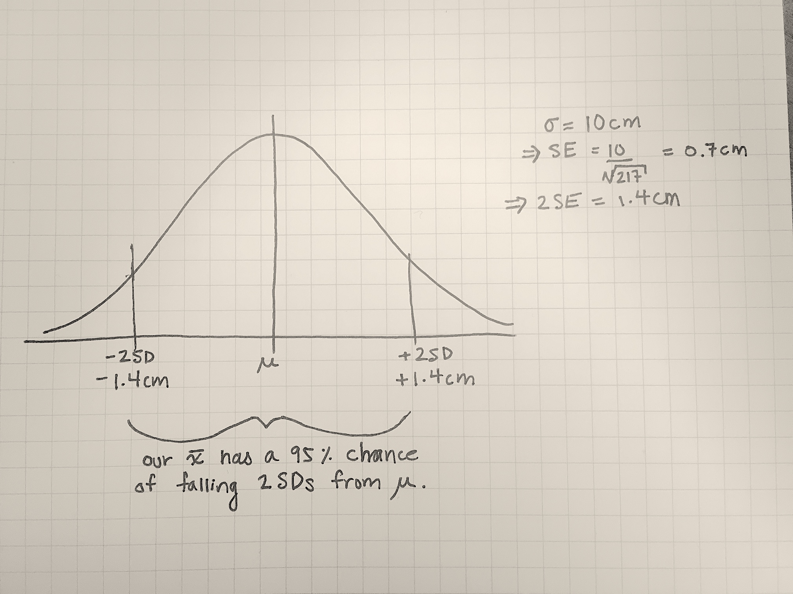
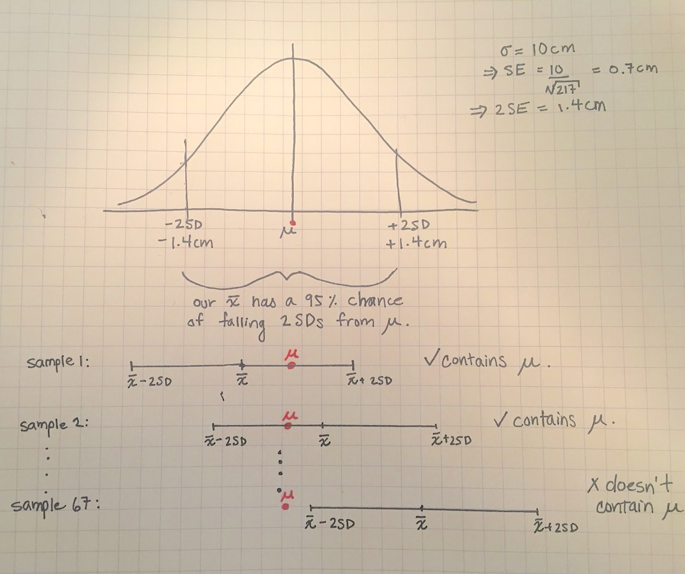
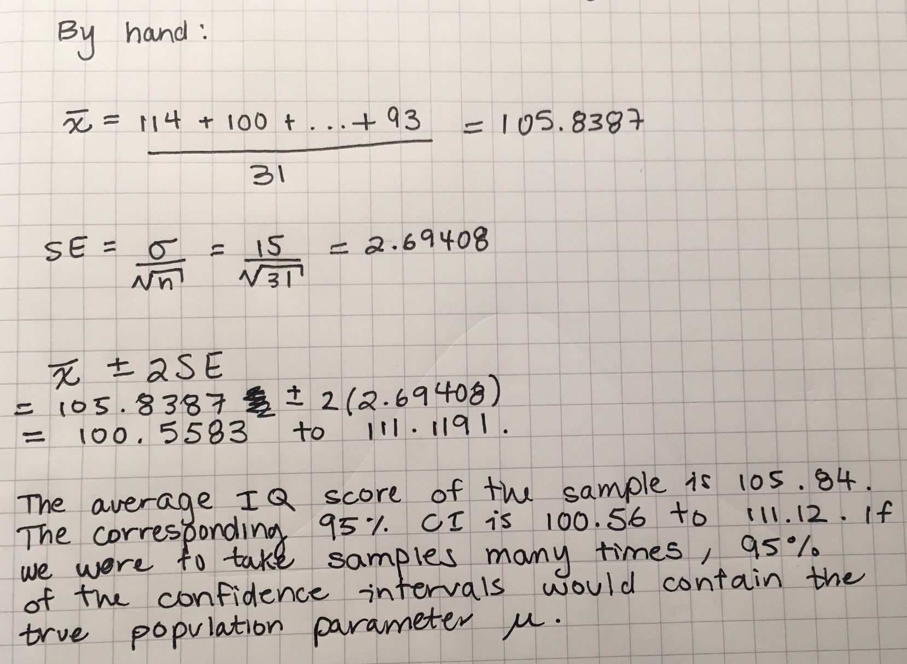

### Announcements

- Assignment 6 will be released today at 9:30am.
- Please read the updated instructions for submitting to Gradescope that is 
part of that assignment. Specifically, you need to tell Gradescope on which 
pages each question is on. If you skip this step you will lose 2 out of 29 
points.
- If you have not read the announcement on academic misconduct, do so 
before this next assignment. We have given penalties for academic misconduct, so ensure that you know our policy to avoid them.

### Learning objectives for today

- What is a confidence interval?
- How to make a confidence interval for your sample's mean when the population 
standard deviation is known

### Statistical Inference

Statistical Inference provides methods for drawing conclusions about a 
population from sample data.

We will talk about:

- Confidence intervals for point estimates
- Hypothesis tests (likely covered on Friday)

### Conditions for inference about a mean

For the methods we discuss today, the following conditions (also called assumptions) need to be present to
use your sample mean $\bar{x}$ to make inference about an underlying population 
mean $\mu$:

1. The sample was a simple random sample from the population of interest. There 
was no non-response or other systematic bias (i.e., no confounding, no 
measurement error, no selection bias). Note: We don't talk much about systematic
error in this class, but it is super important if you have observational data.
Take epidemiology to learn about about systematic error!
2. The population distribution of the variable follows a perfectly Normal distribution $N(\mu, \sigma)$
3. We know the standard deviation in the population $\sigma$. 

### Mean height example

A recent National Health and Nutrition Examination Survey (NHANES) reports that the mean height of a sample of 217 eight-year old
boys was $\bar{x}=132.5$ cm. On the basis of this sample, we want to estimate the 
mean $\mu$ in the population of > 1 million American eight-year-old boys.

First, we need to check if the problem description meets the conditions/assumptions required:

* Assumption 1: SRS
* Assumption 2: Normality
* Assumption 3: known SD

### Mean height example

* Assumption 1: Is it a simple random sample (SRS)? Look here for how [NHANES](https://www.cdc.gov/nchs/nhanes/participant/participant-selected.htm) participants are chosen. It is not an SRS, though random sampling was done within
multiple stages. For this question, we will pretend the sample is a SRS.
* Assumption 2: Assume that the distribution of heights in the total population is Normally distributed.
This is an okay assumption to make about measurements like height. If you had 
access to the sample, we could make a histogram of the data and see if the sample
appears to be roughly Normally distributed and use that as evidence in support of
this assumption.
* Assumption 3: We are not provided the population standard deviation $\sigma$, but perhaps we
could do some research and find that $\sigma = 10$cm can be assumed as the population
standard deviation. In this class, if you are asked to assume a standard deviation, it will be provided to you by the question.

### Calculating a 95% confidence interval

- Recall that $\bar{x}$ is an unbiased estimator of $\mu$. This means that if you
took multiple samples, the average of the samples' $\bar{x}$s equals $\mu$.
- Under repeated sampling, the sampling distribution of $\bar{x}$ is Normally 
distributed with a mean of $\mu$ and standard deviation $\frac{\sigma}{\sqrt{n}}=\frac{10}{\sqrt{217}}=0.7$ cm. This follows from yesterday's
lecture.
- On scratch paper, we can draw the Normal distribution for the sampling 
distribution, and shade in the middle 95% of the area within 2 standard 
deviations of the mean. 

```{r,echo=F, fig.align='center', out.width="80%"}

```

### Calculating a 95% confidence interval (continued)

- An $\bar{x}$ from any random sample has a 95% chance of being within 2 SD of the 
population mean $\mu$. 
- This implies that for 95% of samples, 1.4 cm is the maximum distance separating $\bar{x}$ and $\mu$.
- If we estimate that the value $\mu$ is somewhere in the interval from $\bar{x}-1.4$ to 
$\bar{x} + 1.4$, we'll be right 95% of the time. 

- That is, 95% of the intervals we make will contian the true parameter value.

```{r,echo=F, fig.align='center', out.width="80%"}

```

### Calculating a 95% confidence interval (continued)

Using the sample estimate $\bar{x}=132.5$ and the standard error of the sampling distribution of 1.4, our interval has a lower bound of:

$$\bar{x}-1.4 = 132.5-1.4 = 131.1$$

And an upper bound of:

$$\bar{x}+1.4 = 132.5+1.4 = 133.9$$

### IMPORTANT: Interpretation of a confidence interval

- Our best guess for $\mu$ is 132.5.
- Given we only took one sample of size n=217, this best estimate is imprecise.
- Our 95% confidence interval for $\mu$ is 131.1 to 133.9. 
- If our model assumptions are correct and there is only random error affecting 
the estimate, then 95% of the intervals we make will contain the true value $\mu$.
That is, 19 times out of 20, the intervals we make will contain the true value. 
- This means that the interval $\bar{x} \pm 1.4$ has a 95% success rate in 
capturing within that interval the mean height $\mu$ of all eight-year-old 
American boys.
- I emphasize this as **important** because many people get the interpretation 
wrong, and it is often misinterpreted on the internet and in other sources!
- **Do not use the textbook's shorthand that "we are 95% confident that $\mu$ is
contained in the CI"**. This description is ambiguous and imprecise. 

### What would make the CI smaller (and more precise)?

- If we increase the sample size, the confidence interval becomes narrower and more precise
- If the underlying variability in the data was smaller (i.e., $\sigma$ was 
smaller), than the CI would be more precise.

### Definitions: Margin of error and confidence level

The 95% confidence interval we made took this format:

$$estimate \pm 2\times SE$$
$$estimate \pm \text{margin of error}$$

For a 95% confidence interval:

* 95% is called the **confidence level**
* The **margin of error** is $2\times SE$ for a 95% confidence level
* The margin of error is different for different confidence levels. For example,
if we wanted to make a 99% confidence interval, would the margin of error increase
or decrease?

### Confidence intervals for the mean $\mu$

This table summarizes the number (which we refer to as the **critical value z* **
to multiply by the $SE$ for different confidence levels:

| Confidence level C | 90%   | 95%                 | 99%   |
|-------------------:|:-----:|:-------------------:|:-----:|
| Critical value z*  | 1.645 | 1.960 ($\approx 2$) | 2.576 |

- These numbers correspond to the value on the x-axis corresponding to having 90%,
95%, or 99% of the area under the Normal density between -z and z. For example,
the middle 90% of the area under a Normal density curve lies between -1.645 and 
+1.645.
- Thus, a 90% confidence interval is of the form:

$$\bar{x} \pm 1.645\frac{\sigma}{\sqrt{n}}$$

### Confidence interval for the mean of a Normal population

Draw a SRS of size $n$ from a Normal population having unknown mean $\mu$ and
known standard deviation $\sigma$. A level C confidence interval for $\mu$ is:

$$\bar{x} \pm z^*\frac{\sigma}{\sqrt{n}}$$

We can rewrite this as:

$\text{unbiased estimate} \pm \text{(critical value)}\times{\text{(sd of the distribution of the estimate)}}$

$\text{unbiased estimate} \pm \text{(critical value)}\times{\text{(standard error)}}$

### Steps in finding confidence intervals

1. Problem: Statement of the problem in terms of the parameter you would like 
to estimate

2. Plan: How will you estimate this parameter? What type of data will you collect?

3. Data: After you plan the study, collect the data you need to answer the problem.

4. Analysis: Evaluate whether the assumptions required to compute a confidence 
interval are satisfied. Calculate the estimate of the mean and its confidence 
interval. 

5. Conclusion: Return to the practical question to describe your results in this
setting.

### Example on IQ scores (pg. 354)

We are interested in the mean IQ scores of 7th grade girls in a Midwest school 
district. Here are the scores for 31 randomly selected seventh-grade girls. We
also know that the standard deviation of IQ scores is 15 points:

```{r the-sample-data}
scores <- c(114, 100, 104, 89, 102, 91, 114, 114, 103, 105, 
            108, 130, 120, 132, 111, 128, 118, 119, 86, 72,
            111, 103, 74, 112, 107, 103, 98, 96, 112, 112, 93)

iq_data <- data.frame(scores)

known_sigma <- 15
```

Estimate the mean IQ score $\mu$ for all seventh grade girls in this Midwest 
school district by giving a 95% confidence interval.

### Example on IQ scores (pg. 354)

First check the three conditions (also called assumptions):

1. Normality: We can evaluate this using a histogram.
2. SRS: Does the information provided say this is a SRS? We cannot evaluate this
assumption by looking at a plot.
3. Known $\sigma$: Is $\sigma$ known?

### Assess Normality

```{r, warning=F, message=F, echo=F, out.width="80%", fig.align='center'}
library(tidyverse)
ggplot(iq_data, aes(x = scores)) + 
  geom_histogram(binwidth = 5, col = "white") +
  theme_minimal(base_size = 15)
```

We can examine the Normality of the population (because we don't have data on 
the entire population) but we can make a plot for the sample. These data appear slightly 
left-skewed, but since there is not much data, it may actually follow a Normal distribution.

### Calculating the estimated mean and its confidence interval

Option 1: Perform calculations by hand

```{r, echo=F, fig.align='center', out.width="80%"}

```

### Calculating the estimated mean and its confidence interval

Option 2: Perform calculations using R

```{r calc-confidence-interval}
sample_mean <- mean(scores)

standard_error <- known_sigma/sqrt(length(scores))
critical_value <- 1.96

lower_bound <- sample_mean - critical_value*standard_error
upper_bound <- sample_mean + critical_value*standard_error

sample_mean
standard_error
lower_bound
upper_bound
```

The sample estimate of the mean is 105.84. Its 95% confidence
interval is from 100.56 to 111.12. If our model assumptions are correct and there is 
only random error affecting the estimate, this method for calculating confidence 
intervals will contain the true value $\mu$ 95% of the time (19 times out of 20).

### Recap

* We learned how to create a confidence interval for the mean when the standard deviation for the population is known.
* We learned about the three required assumptions and how to check the Normality assumption using a histogram.
* We learned how to interpret the confidence interval and the definitions for the confidence level and the margin of error