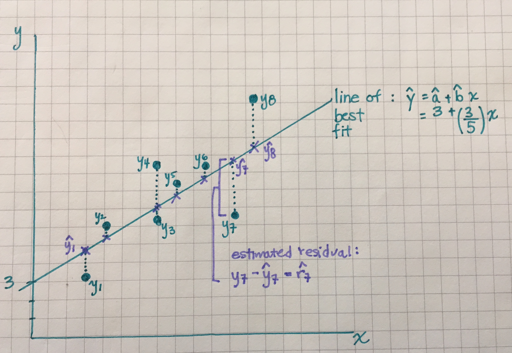

### Regression review 

Reminder of what we've done in regression in Part I of the course:

- Graph the data: scatter plot of the relationship between X and Y 
    - Does the relationship look linear? If so, what is the correlation coefficient, $\hat{r}$?
    - If not, can we transform X, Y, or both to have a linear relationship on the
    transformed scale?
- Calculate` the line of best fit using `lm()`
- Using `glance()` and `tidy()` from the library `broom` to summarize the linear
model findings
- Interpret the slope ($\hat{b}$) and intercept ($\hat{a}$) parameters
- Interpret the $\hat{r}^2$ value
    
### What are the regression "statistics?"

- I changed something about the way I presented the notation on the last slide 
vs. earlier in the course to give you a clue.
- $\hat{r}$, $\hat{r}^2$, $\hat{a}$, and $\hat{b}$ are all statistics based on 
the sample we chose. That is, if we chose a different SRS and re-plotted the data
and re-ran the regression, their values would also change.
- When we are specifically interested in the **effect** of some explanatory variable
$x$ on $y$, then our main interest is often in the underlying parameter $b$, the
slope coefficient for $x$.
- For now, we interpret $b$ as an **association** rather than a causal effect 
because we have not learned in this class how to build causal models. 
- Today we revisit the output from regression models and apply the inference 
techniques from Part III of the course to regression.

### Assumptions that require checking for regression inference

- The way we state the assumptions is different from the text book
- Focus on the four assumptions stated on the next slide, **not** the textbook's 
version

### Assumptions that require checking for regression inference

1. The relationship between $x$ and $y$ is linear in the population

### Assumptions that require checking for regression inference

2. $y$ varies Normally around the line of best fit. That is, the **residuals** vary Normally
around the line of best fit. 

**Residuals**: Residuals refer to the vertical distance between the line of best
fit and the observed $y$ value. You can draw a residual for every point on the 
scatter plot between its value and the line of best fit. 

The assumption is that the lengths of these residuals is Normally distributed.

### Assumptions that require checking for regression inference

3. Observations are independent. 

Often we can't check this using a plot, it is 
based on what we know about the study design.

### Assumptions that require checking for regression inference

4. The standard deviation of the responses is the same for all values of $x$

What does this mean? Consider a line of best fit where the underlying $x$ values 
vary between 1 and 10. This assumption means that the spread of the responses (the $y$ values)
where $x=1$ is similar to the spread of the responses when $x=10$.

### Assumptions that require checking for regression inference

1. The relationship between $x$ and $y$ is linear in the population
2. $y$ varies Normally around the line of best fit. That is, the **residuals** vary Normally
around the line of best fit. 
3. Observations are independent. 
4. The standard deviation of the responses is the same for all values of $x$

Except for assumption #3, these assumptions can be investigated by examining the **estimated residuals**

We also use these plots to keep an eye out for **outliers**, which can sometimes
have a large effect on $\hat{a}$ and $\hat{b}$

### Terminology needed to understand the assumptions

* **Observed value**: $y$
* **Fitted (or predicted) value**: $\hat{y} = \hat{a} + \hat{b}x$
* **Estimated residual**: $\hat{r} = \text{observed value - fitted value} = y - (\hat{a} + \hat{b}x)$

### Terminology needed to understand the assumptions, visualized

```{r, out.width="80%", fig.align='center', echo=F}

```

### Example 1: Investigating the assumptions

```{r lm-diagnostics_no-violations-example, fig.align='center', out.width="80%", echo=F, warning=F, message=F}
library(broom)
library(ggplot2)
library(dplyr)
library(tidyr)

# students, don't worry about the code in the next six lines.
# I will provide the required code later in the slides.
set.seed(123)
x <- seq(1, 10, length.out = 60)
y <- 12 + 2.5 * x + rnorm(n = 60, mean = 0, sd = 2)
dat1 <- data.frame(x, y)

lm1 <- lm(y~x, data = dat1)
augmented_dat1 <- augment(lm1)

## Fitted model
plot1 <- ggplot(augmented_dat1, aes(x, y)) +
  geom_smooth(method = "lm", se = F) +
  geom_point() +
  geom_segment(aes(xend = x, yend = .fitted), lty = 2) +
  theme_minimal(base_size = 15) +
  labs(title = "(a) Scatter plot") 

# QQ plot
plot2 <- ggplot(augmented_dat1, aes(sample = .resid)) + 
  geom_qq() + 
  geom_qq_line() +
  theme_minimal(base_size = 15) +
  labs(y = "Residuals", x = "Theoretical quantiles", title = "(b) QQplot") 

## Fitted vs. residuals
plot3 <-ggplot(augmented_dat1, aes(y = .resid, x = .fitted)) + 
  geom_point() + 
  theme_minimal(base_size = 15) +
  geom_hline(aes(yintercept = 0)) +
  labs(y = "Residuals", x = "Fitted values", title = "(c) Fitted vs. residuals") 

## Amount explained
reshape <- augmented_dat1 %>% select(.resid, y) %>%
  gather(key = "type", value = "value", y, .resid)

plot4 <- ggplot(reshape, aes(y = value)) + 
  geom_boxplot(aes(fill = type)) +
  labs(title = "(d) Amount explained") +
  theme_minimal(base_size = 15) 

library(patchwork)
plot1 + plot2 + plot3 + plot4 + plot_layout(nrow = 2) + 
  plot_annotation(caption = "A good fit to the data")
```

### Some information about each of the four plots

Plot (a) shows a fitted regression line and the data. The estimated residuals are 
shown by the dashed lines. We want to see that the residuals are sometimes positive
and sometimes negative with no trend in their location

Plot (b) shows a QQ plot of the residuals (to check if they're Normally distributed)

Plot (c) shows a plot of the fitted values vs. the residuals. We want this to look like
a random scatter. If their is a pattern then an assumption has been violated. We 
will shown examples of this.

Plot (d) shows a boxplot of the distribution of y vs. the distribution of the residuals.
If x does a good job describing y, then the box plot for the residuals will be 
much shorter because the model fit is good

### Example 1: Investigating the assumptions

- Plot (a): The residuals are sometimes positive and sometimes negative and their
magnitude varies randomly as x increases
- Plot (b): The residuals appear to be Normally distributed
- Plot (c): A random scatter - good
- Plot (d): The model fits the data well because the variation in the residuals 
is much smaller than the variation in the y variable to begin with.

### Example 2: Investigating the assumptions

```{r lm-diagnostics_violation-linearity-example, fig.align='center', out.width="80%", echo=F}
x2 <- seq(1, 10, length.out = 60)
y2 <- 12 + 2.5 * x2 + 1.2 * x2^2 + rnorm(n = 60, mean = 0, sd = 3) #the linearity assumption is violated
dat2 <- data.frame(x2, y2)

lm2 <- lm(y2 ~ x2, data = dat2)
augmented_dat2 <- augment(lm2)

## Fitted model
plot1_2 <- ggplot(augmented_dat2, aes(x2, y2)) +
  geom_smooth(method = "lm", se = F) +
  geom_point() +
  geom_segment(aes(xend = x2, yend = .fitted), lty = 2) +
  theme_minimal(base_size = 15) +
  labs(title = "(a) Scatter plot") 

# QQ plot
plot2_2 <- ggplot(augmented_dat2, aes(sample = .resid)) + 
  geom_qq() + 
  geom_qq_line() +
  theme_minimal(base_size = 15) +
  labs(y = "Residuals", x = "Theoretical quantiles", title = "(b) QQplot")

## Fitted vs. residuals
plot3_2 <-ggplot(augmented_dat2, aes(y = .resid, x = .fitted)) + 
  geom_point() + 
  theme_minimal(base_size = 15) +
  geom_hline(aes(yintercept = 0)) +
  labs(y = "Residuals", x = "Fitted values", title = "(c) Fitted vs. residuals")

## Amount explained
reshape_2 <- augmented_dat2 %>% select(.resid, y2) %>%
  gather(key = "type", value = "value", y2, .resid)

plot4_2 <- ggplot(reshape_2, aes(y = value)) + 
  geom_boxplot(aes(fill = type)) +
  theme_minimal(base_size = 15) +
  labs(title = "(d) Amount explained") 

plot1_2 + plot2_2 + plot3_2 + plot4_2 + plot_layout(nrow = 2) + 
  plot_annotation(caption = "The linear relationship assumption does not hold")
```

### Example 2: Investigating the assumptions

- Plot (a): While the residuals are small there is a pattern: they start positive,
then turn negative and become positive again (as x increases). 
- Plot (b): The QQ plot does not support Normality because it is much different
from a line
- Plot (c): There is a trend in the residuals vs. fitted. This accentuates the 
pattern observed in plot (a)
- Plots (a)-(c) all provide evidence against the assumption that a linear fit is
the most appropriate one. Because the fit is actually curved, this relationship
would require a $x^2$ term in the model, i.e., $\hat{y} = \hat{a} + \hat{b}x + \hat{c}x^2$
- Plot (d): However, even though the linearity assumption is violated, the linear
model still explains a lot of the variation so it still offers insight into 
explaining y, even if it isn't the best model

### Example 3: Investigating the assumptions

```{r lm-diagnostics_violation-sd, fig.align='center', out.width="80%", echo=F}
x3 <- seq(1, 10, length.out = 60)
y3 <- 12 + 2.5 * x3 + rnorm(n = 60, mean = 0, sd = 2*x3) #the constant variance assumption is violated
dat3 <- data.frame(x3, y3)

lm3 <- lm(y3 ~ x3, data = dat3)
augmented_dat3 <- augment(lm3)


## Fitted model
plot1_3 <- ggplot(augmented_dat3, aes(x3, y3)) +
  geom_smooth(method = "lm", se = F) +
  geom_point() +
  geom_segment(aes(xend = x3, yend = .fitted), lty = 2) +
  theme_minimal(base_size = 15) +
  labs(title = "(a) Scatter plot")

# QQ plot
plot2_3 <- ggplot(augmented_dat3, aes(sample = .resid)) + 
  geom_qq() + 
  geom_qq_line() +
  theme_minimal(base_size = 15) +
  labs(y = "Residuals", x = "Theoretical quantiles", title = "(b) QQplot")

## Fitted vs. residuals
plot3_3 <-ggplot(augmented_dat3, aes(y = .resid, x = .fitted)) + 
  geom_point() + 
  theme_minimal(base_size = 15) +
  geom_hline(aes(yintercept = 0)) +
  labs(y = "Residuals", x = "Fitted values", title = "(c) Fitted vs. residuals") 

## Amount explained
reshape_3 <- augmented_dat3 %>% select(.resid, y3) %>%
  gather(key = "type", value = "value", y3, .resid)

plot4_3 <- ggplot(reshape_3, aes(y = value)) + 
  geom_boxplot(aes(fill = type)) +
  theme_minimal(base_size = 15) +
  labs(title = "(d) Amount explained")

plot1_3 + plot2_3 + plot3_3 + plot4_3 + plot_layout(nrow = 2) + 
  plot_annotation(caption = "The constant variance assumption does not hold")
```

### Example 3: Investigating the assumptions
 
- Plot (a): This might look okay at first glance, but notice that the magnitude
of the residuals is very small for x-values < 2.5, and then it increases
- Plot (b): Also shows some issues in the upper tail
- Plot (c): There is a definite pattern in this plot known as "fanning out".
"Fanning out" is describing the sideways triangle you would see if you were to 
draw an outline around the set of points. Here, we see that as the fitted value 
increases, the residuals become further from 0. Fanning out happens when the 
constant variance assumptions does not hold.
 
### A note on these diagnostic plots

- If you chose a different sample, the diagnostic plots would change
- Be careful not to over interpret them
- Our goal is to learn about the population, but we only have our one sample

### A note on these diagnostic plots

- Regression procedures are not too sensitive to lack of Normality
- Outliers are important though because they have the potential to have a large
effect on the intercept and/or slope terms.

### Example from the text book

Read in the data on frog mating call frequency and temperature:

```{r, fig.align='center', out.width="80%"}
library(tibble)

frog_data <- tibble(id = 1:20,
       temp = c(19, 21, 22, 22, 23, 23, 23, 23, 23, 
                24, 24, 24, 24,
                25, 25, 25, 25, 26, 26, 27),
       freq = c(38, 42, 45, 45, 41, 45, 48, 50, 53, 51, 48, 53, 47,
                53, 49, 56, 53, 55, 55, 54))
```

### Scatter plot

```{r, fig.align='center', out.width="80%"}
ggplot(frog_data, aes(x = temp, y = freq)) +
  geom_point() +
  theme_minimal(base_size = 15) +
  labs(x = "Temperature (Celcius)", y = "Frequency of mating calls")
```

- Does the relationship look linear?
- Is the relationship positive or negative?

### Run the linear model

Here are the functions we learnt in Part I of the course:

```{r}
frog_lm <- lm(formula = freq ~ temp, data = frog_data)
tidy(frog_lm)
glance(frog_lm)
```

### Check the model diagnostics

```{r}
frog_lm_augment <- augment(frog_lm)

frog_lm_augment %>% select(freq, temp, .fitted, .resid) %>% head()
```

- `augment()` is another `broom` function. It augments the original data frame
with the residual (`.resid`) and fitted (`.fitted`) values, among other values
that we won't talk about now.

- Make sure to know the `augment` command!

### Check the model diagnostics

```{r, fig.align='center', out.width="80%"}
  ggplot(frog_lm_augment, aes(temp, freq)) +
  geom_smooth(method = "lm", se = F) +
  geom_point(alpha = 0.5) +
  geom_segment(aes(xend = temp, yend = .fitted), lty = 2, alpha = 0.5) +
  theme_minimal(base_size = 15) +
  labs(title = "(a) Scatter plot")
```

### Check the model diagnostics

```{r, fig.align='center', out.width="80%"}
# QQ plot
  ggplot(frog_lm_augment, aes(sample = .resid)) + 
  geom_qq() + 
  geom_qq_line() +
  theme_minimal(base_size = 15) +
  labs(y = "Residuals", x = "Theoretical quantiles", title = "(b) QQplot")

```

### Check the model diagnostics

```{r, fig.align='center', out.width="80%"}
## Fitted vs. residuals
  ggplot(frog_lm_augment, aes(y = .resid, x = .fitted)) + 
  geom_point() + 
  theme_minimal(base_size = 15) +
  geom_hline(aes(yintercept = 0)) +
  labs(y = "Residuals", x = "Fitted values", title = "(c) Fitted vs. residuals") 

```

### Check the model diagnostics

```{r, fig.align='center', out.width="80%"}
## Amount explained
frog_gather <- frog_lm_augment %>% select(freq, .resid) %>%
  gather(key = "type", value = "value", freq, .resid)

ggplot(frog_gather, aes(y = value)) + 
  geom_boxplot(aes(fill = type)) +
  theme_minimal(base_size = 15) +
  labs(title = "(d) Amount explained")
```

### Example for you to work on

The breaking strength of steel bolts is measured by subjecting a bolt to 
increasing (lateral) force and determining the force at which the bolt breaks.
This force is called the breaking strength; it depends on the diameter of the 
bolt and the material the bolt is composed of. There is variability in breaking
strengths: Two bolts of the same dimension and aterial will generally break at
different forces. Understanding the distribution of breaking strengths is 
very important in construction and other areas.

The data below show the breaking strengths of six steel bolts at each of five
different bolt diameters.

```{r}
diameter <- c(rep(0.10, 6), rep(0.20, 6), rep(0.3, 6), rep(0.4, 6), rep(0.5, 6))
breaking_strength <- c(1.62, 1.73, 1.70, 1.66, 1.74, 1.72, 
                       1.71, 1.78, 1.79, 1.86, 1.70, 1.84,
                       1.86, 1.86, 1.90, 1.95, 1.96, 2.00,
                       2.14, 2.07, 2.11, 2.18, 2.17, 2.07, 
                       2.45, 2.42, 2.33, 2.36, 2.38, 2.31)

bolt_data <- tibble(diameter, breaking_strength)
```

### Example for you to work on

1. Which variable is the response and which variable is the explanatory?
2. Fit a linear model to these data and add the residuals and fitted values to a 
data frame alongside the original data. 
3. Make a plot of the residuals vs. the fitted values. Comment on what you see. 
Is an assumption violated?
4. Add a quadratic term to the dataset. You can do this using `mutate()`. Then
re-run the linear model using this template: `lm(formula = y ~ x + x_squared, dat = your_data)`
5. Re-make the residual vs. fitted plot after this model and comment on the difference.

### Example's solutions

1. Which variable is the response and which variable is the explanatory?

Answer: The breaking strength is the response variable and the diameter is the 
explanatory variable. This is because the question says that breaking strength 
depends on the diameter of the bolt.

2. Fit a linear model to these data and add the residuals and fitted values to a 
data frame alongside the original data. 

```{r}
bolt_model <- lm(breaking_strength ~ diameter, bolt_data)
augmented_bolt_data <- augment(bolt_model)
```

3. Make a plot of the residuals vs. the fitted values. Comment on what you see. 
Is an assumption violated?

```{r}
ggplot(data = augmented_bolt_data, aes(x = .fitted, y = .resid)) + geom_point() + 
  theme_minimal(base_size = 15) +
  geom_hline(aes(yintercept = 0)) +
  labs(y = "Residuals", x = "Fitted values", title = "(c) Fitted vs. residuals")
```


There is a curved pattern in this plot -- the residuals are generally positive,
then generally negative, followed by positive again. This indicates that the 
linearity assumption is violated.

4. Add a quadratic term to the dataset. You can do this using `mutate()`. Then
re-run the linear model using this template: `lm(formula = y ~ x + x_squared, dat = your_data)`

```{r}
#add a squared term to the dataset
bolt_data <- bolt_data %>% mutate(diameter2 = diameter^2)

bolt_model_2 <- lm(formula = breaking_strength ~ diameter + diameter2, dat = bolt_data)

augment_bolt_data2 <- augment(bolt_model_2)
```

5. Re-make the residual vs. fitted plot after this model and comment on the difference.

```{r}
ggplot(data = augment_bolt_data2, aes(x = .fitted, y = .resid)) + geom_point() + 
  theme_minimal(base_size = 15) +
  geom_hline(aes(yintercept = 0)) +
  labs(y = "Residuals", x = "Fitted values", title = "(c) Fitted vs. residuals")

```

The pattern from the previous plot cannot be seen in this plot, showing that the
model including the quadratic term is a better fit to these data.