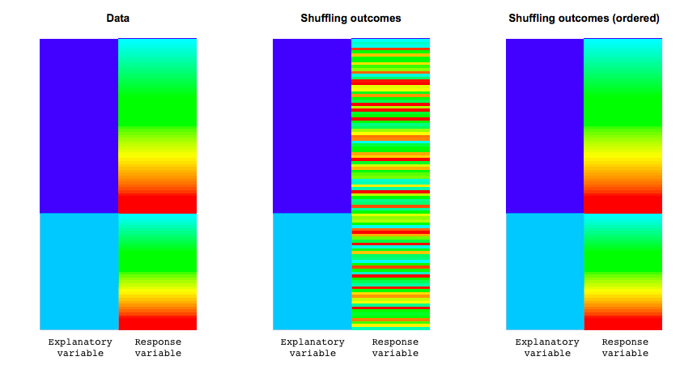
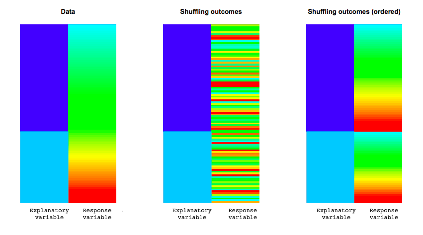

### Permutation tests

The methods we've used so far for hypothesis testing (z-tests, t-tests, and 
chi-square tests) have depended on having large enough sample sizes for the 
inference to be valid. They have also required that the sample was a SRS from 
some larger population.

Today we will talk about another method for conducting hypothesis tests that 
do not require either assumption. 

It might remind you of our bootstrapping lecture, but remember, bootstrapping was
for confidence intervals, whereas permutation tests are for hypothesis testing.

### Example: Beer consumption and mosquito attraction to humans

Background: Malaria and alcohol consumption both represent major public health 
problems. Alcohol consumption is rising in developing countries and, as efforts 
to manage malaria are expanded, understanding the links between malaria and 
alcohol consumption becomes crucial. Our aim was to ascertain the effect of beer
consumption on human attractiveness to malaria mosquitoes in semi field 
conditions in Burkina Faso. - [Lefevre et al, 2010, in *PLOS One*](https://journals.plos.org/plosone/article?id=10.1371/journal.pone.0009546)

### Example: Beer consumption and mosquito attraction to humans

- Volunteers were randomly assigned to drink either beer or water
- Batches of mosquitos were inside a device and could choose to fly towards the
human participant or towards the open air
- The number of mosquitos flying towards the human were counted for each participant

### Example: Beer consumption and mosquito attraction to humans

The data:

```{r}
beer <- c(27, 19, 20, 20, 23, 17, 21, 24, 31, 26, 28, 20, 
          27, 19, 25, 31, 24, 28, 24, 29, 21, 21, 18, 27, 
          20)

water <- c(21, 19, 13, 22, 15, 22, 15, 22, 20, 12, 24, 24, 
           21, 19, 18, 16, 23, 20)

#students, don't need to know how to write the following lines of code.
mosq_data <- data.frame(num_mosquitos = c(beer, water), 
                        treatment = c(rep("beer", 25),
                                      rep("water", 18)))
```

```{r}
head(mosq_data)
```

* `num_mosquitos` is the count of mosquitos the flew towards the participant

* `treatment` is whether the person was randomized to water or beer

### Example: Beer consumption and mosquito attraction to humans

Descriptives: Does there look to be a difference between the groups?

```{r, echo=F, fig.align='center', out.width="80%"}
library(ggplot2)

ggplot(mosq_data, aes(x = treatment, y = num_mosquitos)) +
  geom_boxplot(aes(fill = treatment)) + 
  theme_minimal(base_size = 15) +
  labs(y = "Number of mosquitos", x = "")
```

### Example: Beer consumption and mosquito attraction to humans

Which test that we already know could we use to test whether there is a 
difference between the number of mosquitos attracted to beer and water drinkers?

### Example: Beer consumption and mosquito attraction to humans

Which test that we already know could we use to test whether there is a 
difference between the number of mosquitos attracted to beer and water drinkers?

```{r}
t.test(beer, water, alternative = "two.sided")
```
The average number of mosquitos attracted to beer drinkers was 23.6 vs. 19.22 
attracted to water drinkers.

The p-value was 0.07% which is very small. There is evidence in favor of the 
alternative that there is a difference in the average number of mosquitos 
attracted to beer drinkers and water drinkers.

### Example: Beer consumption and mosquito attraction to humans

There is another way to perform this test. Consider the null hypothesis:

$$H_0: \mu_1 = \mu_2$$

If the two means are the same, then we would expect no difference between the 
number of mosquitos attracted to beer drinkers vs. water drinkers. 

Assuming the null is true: **We could mix up the labels of who drank beer and water and re-compute the 
difference between beer drinkers and water drinkers in the number of mosquitos.**

We could do this many times. For each shuffling of the labels, we could 
re-compute the difference and mark it on a histogram.

### Example: Beer consumption and mosquito attraction to human

Watch this clip from 8:13-9:52: https://youtu.be/5Dnw46eC-0o?t=492.

- It shows the sampling distribution being built for this example under
the null hypothesis of no difference.
- It shows how the labels can be shuffled at random, and after each re-shuffling, 
the mean difference is computed and plotted on an evolving histogram.
- Then a vertical line is added at the **observed** value of the difference 
(based on the data from the sample).
- An observed value in the tails of the distribution implies that it is unlikely
to occur under the null hypothesis of no difference between the groups.

### The `infer` package

The `infer` package is relatively new to the tidyverse (which includes `ggplot2`,
`readr`, `dplyr`, among others)

It is **awesome** because it interjects the steps of hypothesis testing directly
into the code. It also keeps things "tidy" meaning that the output is often
returned in a nice little data frame.

We will use `infer` to conduct permutation tests, but if you're interested you 
could also learn more [here](https://infer.netlify.com/) about doing all your
testing using this package.

Let's have a look!

### The `infer` package for permutation tests

First use the `infer` functions `specify()`, `hypothesize()`, `generate()`, 
and `calculate` to create the histogram of the sampling distribution for the 
mean difference:

```{r}
library(infer)

null_distn <- mosq_data %>% 
  specify(response = num_mosquitos, explanatory = treatment) %>%
  hypothesize(null = "independence") %>%
  generate(reps = 1000, type = "permute") %>%
  calculate(stat = "diff in means", order = c("beer", "water"))

head(null_distn)
```

You won't be tested on the code for the infer package on the final exam, though
you might need to write it on your next assignment. For the final, just understand
the essence between how a permutation test works and the steps to conduct a 
permutation test.

### The `infer` package for permutation tests

Then, use the `infer` function `visualize` to plot the sampling distribution, 
add a line at the observed mean difference, and shade the region corresponding
to the p-value:

```{r, fig.align='center', out.width="80%"}
#null_distn %>% visualize(obs_stat = 23.6-19.22, direction = "two_sided")  
visualize (null_distn, method = "simulation") + shade_p_value(23.6-19.22, direction = "both")
```

### The `infer` package for permutation tests

Finally, calculate the p-value by using the `get_pvalue()` function:

```{r}
null_distn %>% get_pvalue(obs_stat = 23.6-19.22, direction = "two_sided")
```

### Permutation test, shown visually

Example: null is true

```{r, out.width="80%", echo=F}

```

If the null is *true* then the distribution of the response variable is the same
for each level of the explanatory variable. This is shown by the entire spectrum
of colours for both levels of the explanatory variable in this plot. 

After reshuffling, the distribution comes out the same. This illustrates that if 
the null is true, your observed statistic will look like a random reshuffle.

reference: http://faculty.washington.edu/kenrice/sisg/SISG-08-06.pdf

### Permutation test, shown visually

Example: null is false

```{r, out.width="80%", echo=F}

```

If the null is *false* the distribution of the response variable varies for 
each level of the explanatory variable. This is shown by the one level corresponding
to the "blue-green" part of the response variable and the other level corresponding
to "red-yellow".

After reshuffling, the observed data looks very different from the random reshuffle.

reference: http://faculty.washington.edu/kenrice/sisg/SISG-08-06.pdf

### Another example

- So far, we've use the permutation approach to examine whether the observed 
difference indicated a true difference between the means of two continuous variables

- We can use permutation tests to look at all kinds of data, including categorical
data

### Back to the smoking example from last class

```{r}
library(tibble)
two_way <- tribble(~ smoking, ~ non_smoking,
                     12,        238, #row for lung cancer
                     7,         743)

#We can put the data from the 2X2 table into a data frame
smoke_data <- data.frame(id = 1:1000, 
                         smoking = c(rep("yes", 19), rep("no", 238+743)),
                         lung_cancer = c(rep("yes", 12), rep("no", 7),
                                         rep("yes", 238), rep("no", 743))) 
#Take a look at it in the Viewer. You'll see there are 12 people who smoke with 
#lung cancer and so on, as specified by the 2X2 table.

head(smoke_data)
```

### Permutation test on the smoking data

Can we do a permutation test using these data?

### Permutation test on the smoking data

Can we do a permutation test using these data?

Yes! The method is strikingly similar, even though we have categorical data rather
than continuous data. We just need to shuffle/permute the labels to break the 
association between smoking and lung cancer.

What statistic will we calculate? We can still calculate the chi-square statistic
for each of the permutations and make a histogram of those values to get our p-value.

### Permutation test on the smoking data

```{r}
null_distn <- smoke_data %>%
  specify(lung_cancer ~ smoking, success = "yes") %>%
  hypothesize(null = "independence") %>%
  generate(reps = 1000, type = "permute") %>%
  calculate(stat = "Chisq", order = c("yes", "no"))
```

```{r}
#null_distn %>% visualize(method = "theoretical", obs_stat = 13.04)
null_distn %>% visualize() + shade_p_value(obs_stat = 13.04, direction = "right")
# the obs_stat is the observed statistic that we calculated using chisq.test
# from last class, you can also get it using this code:
smoke_data %>% 
  specify(lung_cancer~smoking, success = "yes") %>% 
  calculate(stat = "Chisq", order = c("yes", "no"))
```

```{r}
null_distn %>% get_pvalue(obs_stat = 13.04, direction = "right")
```

The probability is 0 based on the permuted dataset because there are no values 
in the permutation that were larger than 13.04. 

### In summary

- Permutation tests are another way to get p-values for hypothesis tests.
- There is a permutation test equivalent for all the two sample tests that 
we've covered. They each rely on reshuffling (or permuting) the data to break
any relationship between the two variables.
- The `infer` package is a good way to conduct and visualize permutation tests in R.